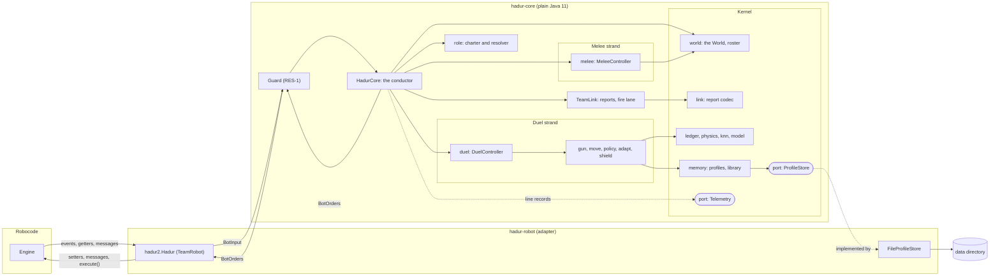
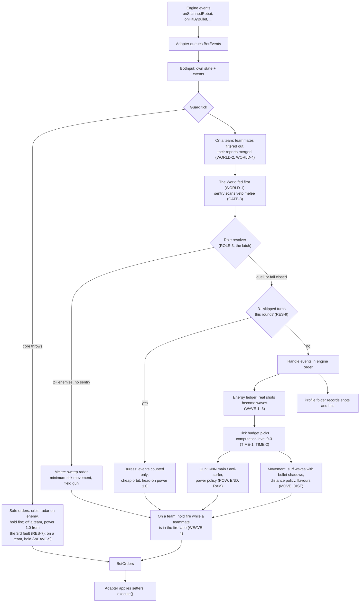
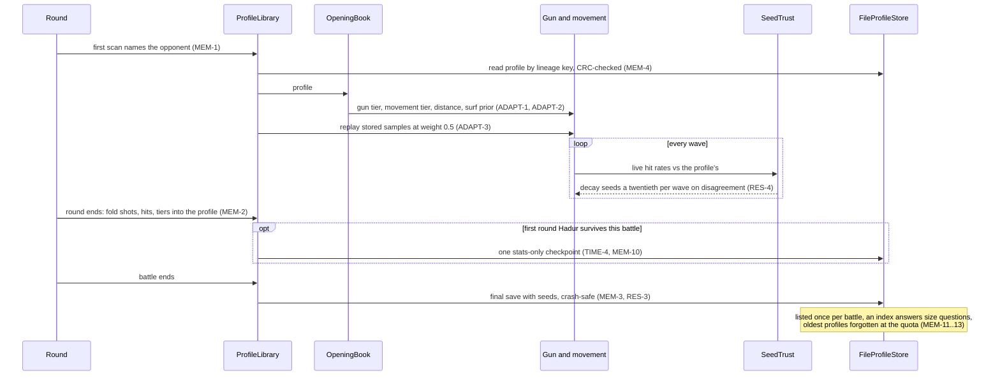
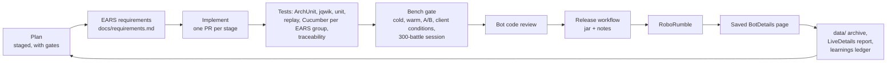

# Hadur 2

**Hadur** (the Hungarian god of war) is a [Robocode](https://robocode.sourceforge.io/) robot:
a 1v1 duelist that remembers each opponent across battles, with a melee brain for
free-for-alls, a five-robot team entry, and a core that has no idea it is inside Robocode.

**Hadur 3.10 is ranked 20th of 1,216 in the RoboRumble 1v1** after its first pass (3.9 reached
13th; [why 3.10 reads lower](docs/bench/live-3.10.md)), 19th in the MeleeRumble and 12th in the
TeamRumble, the highest-ranked robot flying the Irish flag. It was designed, written, tested and tuned by Claude agents working
in a shared project with one human, Leigh Griffin, who set the goals and ran the live
entries. This page covers what the robot does, how it is built, and how it was built.

## Standing

**3.9 was released on 2026-10-07** and its first full 1v1 pass, saved 2026-10-07 20:28 UTC
with every pairing filled, puts `hadur2.Hadur 3.9` 13th, Hadur's best score:

| Rank | APS | PWIN | ANPP | Survival | Pairings | Battles |
|---|---|---|---|---|---|---|
| **13th of 1,216** | **87.15** ± 0.19 | 99.34 | 90.31 | 95.04% | 1,215 | 1,885 |

- **19th in the MeleeRumble** (65.07 APS) and **12th in the TeamRumble** (`hadur2.HadurTeam
  3.9`, 63.97 APS). 3.9 did not change melee or team play.
- **The rammer trial paid off.** 3.8 had fallen to 29th and 3.8.5 to 24th. An overnight
  bisect traced the loss to 3.5's rammer escape (RAM-2), which also ran from ordinary
  close-range fighters and got Hadur hit two to seven times as often. 3.9 (RAM-3) keeps the
  escape only where the battle's own rounds show it pays. It gained 2.36 APS over 3.8.5, evenly
  across every band from rank 51 down ([live notes](docs/bench/live-3.9.md)).
- **10th is 0.56 APS away.** Tomcat 3.68 is 10th at 87.71, and ranks 8 to 12 sit within 0.11
  of each other. Compared opponent by opponent, Tomcat, Knight and Raven score below Hadur
  against the top 150 and about a point a pairing above it against the bots ranked 401st and
  below, which is the whole gap ([the bots above us](docs/bench/live-3.9.md#the-bots-above-us)).

The pages are archived in [`data/rumble/`](data/rumble/). The road to the top 10 is
[issue #135](https://github.com/lgriffin/Hadur_Robot/issues/135) and the plan in the live notes.

### 3.4 at 20th

The live LiteRumble record for `hadur2.Hadur 3.4`, saved 2026-10-01 20:20 UTC with every
pairing filled:

| Rank | APS | PWIN | ANPP | Survival | Pairings | Battles |
|---|---|---|---|---|---|---|
| **20th of 1,216** | **85.90** ± 0.20 | 99.26 | 89.03 | 93.92% | 1,215 | 1,628 |

- **28th in the MeleeRumble** as well (Leigh, 2026-10-01; no melee page is archived yet).
- **Ireland's most successful robot.** Twelve robots in the rumble fly the Irish flag. The
  next best, jam.RaikoMX 0.32, has 82.24 APS (57th).
- **Against the top 19 it wins 10 pairings and loses 9**: it beats Saguaro, Raven,
  XanderCat, Tomcat, GresSuffurd, WaveSerpent, Nene, WhiteFang, Neuromancer and Dookious.
- **It beats expectation against the strong and falls short against the weak**: its
  performance index is +5.1 against the top 100 and −1.7 against the bottom 716, where the
  next ranks are.

[The top-20 analysis](docs/top20-analysis.md) has the full comparison with the 19 robots
above it, and [the band and hour report](docs/bench/live-details-3.4.md) the same page read
by BENCH-5. The saved page is archived in [`data/rumble/`](data/rumble/).

### Rank history

| Release | Date | Live APS | Survival | Rank | What changed |
|---|---|---|---|---|---|
| 3.0 | 2026-09-28 | 81.57 | 82.6% | 64th | Hadur 2 duelist (S0-S6) and the rebuilt melee brain (M0-M6) |
| 3.1 | 2026-09-30 | 81.46 | 83.0% | 16th in its first hour, 65th at the end | R1-R3: client reliability, full power vs weak bots, a gun for surfers |
| 3.4 | 2026-10-01 | 85.90 | 93.9% | 20th (28th melee) | R5-R8: rumble-safe memory, duress mode, movement, memory that stays cheap |
| 3.5.1 | 2026-10-03 | 86.65 | 94.4% | 16th (18th melee) | R9, the ram approach: run from rammers (RAM-2), a planned path against mirror movers (MIR-1) |
| 3.7 | 2026-10-05 | 85.67 | | 21st (18th melee, 32nd team) | A0-A5, the architecture evolution, and the first team entry |
| 3.8 | 2026-10-06 | 84.58 | 91.8% | 29th (16th melee, 12th team) | D1-D5, the DrussGT route, and T1, teammates that no longer collide |
| 3.8.5 | 2026-10-06 | 84.79 | 92.0% | 24th | MATCH-1/2: the DrussGT aim and shield latch only in duels Hadur is not already winning |
| 3.9 | 2026-10-07 | **87.15** | **95.0%** | **13th (19th melee, 12th team)** | RAM-3, the rammer trial: escape a rammer only where its rounds show it pays |
| 3.10 | 2026-10-08 | 86.42 | 93.9% | 20th | The shield sweep: 83 more robots on the shield list (+0.51 APS live); the pass ran 1.25 APS under 3.9's on unchanged code ([live notes](docs/bench/live-3.10.md)) |

3.0 and 3.1 both started near 85.7 APS and slid by 5 to 8 points within hours on live
clients, which the bench could not reproduce. R7's one-JVM session bench and R8 traced it to
the round-end profile save, which scanned a data directory that grows by one file per
opponent ([L-27](data/learnings.md), [skipped-turns plan](docs/skipped-turns-plan.md)).
3.4 shows no slide: its last 400 pairings average 86.3 APS against 84.7 for its first 400.

## What it does

One on one (the duel):

- **Sees the enemy's shots as they really are.** An energy ledger takes our hits, their
  refunds, wall and collision damage out of each energy drop, so only real shots become
  waves (WAVE-1, WAVE-2). Against Shadow 3.83c, 99.8% of the shots a scan can see become
  waves.
- **Surfs those waves and aims with KNN guns.** Guess-factor danger views, and a main and
  an anti-surfer gun chosen by virtual-gun ratings, as in Hadur 1.20.
- **Makes itself harder to hit.** Its own bullets in flight shadow the enemy's waves: the
  angles where an enemy bullet would be shot down are scored as safe (MOVE-1). When a
  known opponent hits it more than its profile says, the movement changes flavour (MOVE-2).
- **Remembers every opponent.** A profile per opponent (hit rates, gun and movement tiers,
  gun and surf samples) is folded in at each round's end and saved within Robocode's data
  quota, crash-safe (MEM-1..5, RES-3).
- **Recognises and adapts.** From the profile it picks its opening gun, surf prior and
  flattener, and replays stored samples at reduced weight; live evidence overrules the
  profile when they disagree (ADAPT-1..3, RES-4).
- **Presses when ahead.** A distance controller comes in while Hadur clearly out-hits the
  enemy, fires full power at guns that cannot hit it, and closes in to finish or ram a
  beaten enemy (DIST-1, POW-1, POW-2, END-1, END-2).
- **Beats bullet shielding.** An enemy that shoots our bullets down is recognised, and our
  aim is jittered so its shield shots miss (SHIELD-1, SHIELD-2).
- **Stays within its time.** A tick budget sheds work, a level at a time, after a slow tick
  or a skipped turn (TIME-1, TIME-2); after three skipped turns in a round it drops to a
  cheap duress mode rather than stall (RES-9).
- **Stays cheap on a rumble client.** Profiles stay small (stats only for most opponents),
  the data directory is listed once per battle, and the oldest profiles are forgotten at the
  quota, so a save stays cheap with hundreds of opponents on disk (MEM-8..13).

Every policy input carries a margin of error, and each policy keeps its conservative
setting until the evidence is certain enough (DIAL-1).

In melee (two or more opponents, no sentry on the field): a gate that falls back to the
duel on a sentry or a fault (GATE-1..5); a radar that keeps spinning with four or more
alive (MRADAR-1, MRADAR-2); minimum-risk movement with virtual bullets from every recorded
shot, clear of other robots' fights (MMOVE-1..5); a learning field gun that aims at every
opponent at once, with an energy table and exact kill shots (MGUN-1..5); and a melee
profile per opponent. When one opponent is left, its 1v1 profile and its shots in flight
go to the duel (MMEM-1, MMEM-2).

## Bench results

Cold benches (no stored profile), 35 rounds × 5 seeds, mean ± 95% interval:

| Against | 1.20 (S0) | 2.2 (S6) |
|---|---|---|
| Shadow 3.83c, score share | 40.8% ± 8.3 | 57.4% ± 5.0 |
| Shadow 3.83c, rounds won | 82 / 175 | 125 / 175 |
| Five sample bots, rounds won | 872 / 875 | 875 / 875 |

Sources: [S0](docs/bench/s0-baseline-1.20-cold.md) and [S6](docs/bench/s6-2.1-cold.md)
bench reports. 3.0 duels exactly as 2.2 does (the duel's sources are pinned).

| Melee, cold, 1000x1000 | 2.2 | 3.0 (M6) |
|---|---|---|
| Reference field (9 established melee bots), APS | 37.9 | 52.7 to 54.6 |
| Challenge field (9 sample bots), firsts of 100 | 33 | 72 |

Source: the [M6 report](docs/bench/m6-gates.md). [The strategy evolution](docs/strategy-evolution.md)
has every stage's figures.

## Architecture

The full description is [docs/architecture.md](docs/architecture.md). Four pictures carry
most of it.

### Hexagonal: a core that does not know it is in Robocode

The strategy lives in `hadur-core`, which sees only plain values. A thin adapter turns
engine events into a `BotInput` and the core's `BotOrders` back into setter calls. ArchUnit
enforces the boundary on every build (CORE-1): no `robocode.*`, no randomness, threads, I/O
or clock in the core. That is what lets the same core be replayed, fuzzed, fault-injected
and benched without an engine.



### One tick

The adapter queues each event in the engine's priority order, builds a `BotInput`, and
calls the guard. On a team, the conductor first takes teammates out of the input and merges
their reports. It feeds the World, then the role resolver picks the role that drives this
tick: Melee or Duel, never both, and only ever stepping down within a round (a sentry
scanned this tick vetoes melee). That role handles the events and returns orders. On a
team, a shot is held while a teammate stands in the fire lane. If the core throws, the guard returns safe orders
(keep orbiting, radar on the enemy, hold fire; off a team, from the third faulting tick in
a round it fires power 1.0 at the enemy's last bearing when the gun is cool, RES-7; on a
team it always holds fire, WEAVE-5), so the robot never stalls.



### Opponent memory and adaptation

Each opponent has a profile on disk under a lineage key (`abc.Shadow 3.84` files as
`abc.Shadow`). The first scan loads it, the opening book turns it into choices, and live
evidence takes over wherever it disagrees with the profile by more than either margin of
error (DIAL-1, RES-4).



### The bench and the loop around it

Nothing merges on a hunch. `hadur-bench` runs real Robocode battles headless; each stage has
a gate the bench must show before merge, and the live rumble pages come back into the repo
as data, so the next plan starts from evidence.



## Built by agents: an exploration of AI and agentic design

Hadur 2 is as much an experiment in how AI agents build software as it is a robot. Hadur
1.x (up to 1.20) was evolved release by release, by feel. Hadur 2 was rebuilt from 2026-09-26
to 2026-10-01 by Claude sessions working in one shared project: 50 merged pull requests, about
24,000 lines of production Java and 12,000 of tests, from a 64th-place 3.0 to a 20th-place
3.4 (and, by 2026-10-07, a 13th-place 3.9). Leigh set the goals, made the calls only a human could (what "good" means, when to
enter the rumble), and carried the live entries; everything else was done by agents. What
follows is what made that work, and where it did not.

### Roles: a planner and implementers

Work was split by kind, not just by size. A planning model (Fable) read the evidence and
wrote each plan: the [Hadur 2 plan](https://claude.ai/artifact/KDkC1j5Yj8vWH6XQydyYH8)
(S0-S7), the melee extension (M0-M6), and the rumble climb ([R4-R6](docs/rumble-climb-r4-r6-plan.md),
[top 30](docs/rumble-climb-top30-plan.md), [memory at scale](docs/rumble-memory-scale-plan.md)).
Implementation threads (Sonnet) then built each plan stage by stage, one PR per stage. The
planner also reviewed: [the skipped-turns plan](docs/skipped-turns-plan.md) checks an
implementer's diagnosis against the raw session logs and the engine source, confirms the
cause, and corrects four points before the code was written. A coordinating session watched
the project chat, started a thread per ask, and kept the shared memory; each thread worked
alone on its task and reported back where it was asked.

### Requirements as the contract between agents

Every behaviour is an [EARS](docs/requirements.md) requirement (Ubiquitous, Event, State,
Unwanted, Optional), more than a hundred of them, each with a stable ID that never changes
meaning. A requirement is the unit an agent is asked to deliver, and the build holds it to
it: a traceability test fails `mvn verify` if any ID has no test, every Cucumber scenario is
tagged with the IDs it proves, and the Javadoc cites the IDs next to the code that meets
them. A planner can name `MEM-12` and an implementer days later, in a fresh session with no
memory of the plan, knows exactly what done means.

### Guardrails that do not depend on the agent remembering them

Agents start cold. Rules that live only in a prompt get lost, so the important ones are
enforced by the build:

- **ArchUnit** keeps the hexagon intact: no Robocode in the core, no randomness, threads,
  reflection, I/O or clock, and a fixed direction of dependencies between packages.
- **"1v1 is sacred."** `DuelIdentityTest` pins a hash of every duel source file, so melee work
  that touches the duel fails the build unless the PR re-pins it deliberately and says why.
- **Replay fixtures** of recorded battles fail on any unintended change of play; determinism
  (CORE-2) makes them exact.
- **Doclint** fails the build on a broken Javadoc link or a wrong `@param`.

### The bench as ground truth

Agents are fluent and confident; a bench is neither. Each stage had a numeric gate (score
share against Shadow, rounds won against the samples, APS in a reference melee field) with
95% intervals over seeds, and a stage merged only when the bench showed it. The bench grew
with the questions: cold and warm modes, a stratum-weighted estimate over the live rankings
(BENCH-1), paired-seed A/B (BENCH-2), client conditions (BENCH-4), a reader for live pages
(BENCH-5) and a 300-battle one-JVM session with a control robot (BENCH-6, BENCH-7). Ideas that
benched badly were dropped on the evidence: TIME-6 was built, measured as harmful, and
removed ([r8-memory-scale](docs/bench/r8-memory-scale.md)).

### Memory across sessions

A session's context ends; the project does not. Three layers carry what one agent learned to
the next:

- **The repository itself**: plans, bench reports, release notes and the
  [strategy evolution](docs/strategy-evolution.md).
- **[`data/`](data/)**: every saved rumble page byte for byte, parsed tables, flat bench
  history, and [a learnings ledger](data/learnings.md) of findings, each with its evidence
  and status (open or confirmed).
- **Project memory**: a shared note store every session reads at start, with decisions,
  conventions and hand-offs.

### Review by agents, for agents

Stage PRs went through an automated code review, and the implementing thread treated each
finding as a bug report. The record shows why: on PR #61 the review caught a power margin so tight the
rule could never fire live while its tests passed, a kill-power cap that could cost a
low-energy gun its shot, and a rammer detector reading our own movement as theirs
([strategy evolution, R2](docs/strategy-evolution.md)).

### What was hard

- **The bench and the rumble disagreed for three days.** 3.0 and 3.1 lost 5 to 8 APS within
  hours on live clients, and no bench reproduced it. It took a new kind of bench (one engine,
  300 battles, a control robot) to find the cause: the round-end save grew with the number of
  opponents on disk. Agents can only test what they can simulate; widening the simulation was
  the fix.
- **Sessions cannot reach everything.** The container could not push tags, reach the
  rumble's wiki, or play on a real client. Leigh saved the live pages and carried the entries,
  and releases moved to a workflow the agents can dispatch.
- **Speed against evidence.** When live passes were too slow for three releases, R5, R7 and
  R6 shipped together as 3.3 and their long gates moved to one end-of-plan pass, a trade made
  explicitly in the [3.3 notes](docs/releases/v3.3.md).

## Open work

Follow-ups are tracked as [GitHub issues](https://github.com/lgriffin/Hadur_Robot/issues);
[followup.md](followup.md) keeps the notes behind them, stage by stage.

## The plan

Hadur 2 was rebuilt in stages from the "Hadur 2: a duelist that remembers" plan. Every
stage was gated by the bench, and every requirement in
[docs/requirements.md](docs/requirements.md) is written in EARS form and traced to the
tests that prove it.

| Stage | What | State |
|---|---|---|
| S0 | Headless bench and 1.20 baseline | done ([baseline](docs/bench/s0-baseline-1.20-cold.md)) |
| S1 | Hexagonal extraction: core, adapter, guard, replay | done ([bench](docs/bench/s1-2.0-cold.md)) |
| S2 | Energy ledger, radar reacquire | done ([bench](docs/bench/s2-2.0-cold.md)) |
| S3 | Opponent memory | done ([cold](docs/bench/s3-2.1-cold.md), [warm](docs/bench/s3-2.1-warm.md)) |
| S4 | Recognise and adapt | done ([cold](docs/bench/s4-2.1-cold.md), [warm](docs/bench/s4-2.1-warm.md)) |
| S5 | Aggressive: distance controller, full-power shots, finishing and ramming | done ([cold](docs/bench/s5-2.1-cold.md), [warm](docs/bench/s5-2.1-warm.md)) |
| S6 | Unhittable: bullet shadows, go-to surfing, movement flavours, the tick budget | done ([cold](docs/bench/s6-2.1-cold.md), [warm](docs/bench/s6-2.1-warm.md)) |
| S7 | Rewrite the docs to match the code; release 2.2 | done; melee kept (below) |
| 2.1 | Melee brain in the core (MELEE-1..8), Java 11 target (REL-1) | released ([samples](docs/bench/melee-2.1-samples.md), [classic](docs/bench/melee-2.1-classic.md), [strong](docs/bench/melee-2.1-strong.md)) |
| Shield | Bullet-shielding counter (SHIELD-1, SHIELD-2) | done ([Saguaro](docs/bench/shield-counter-saguaro.md), [notes](docs/bullet-shielding.md)) |
| M0-M6 | Melee Extension Plan: fail-closed gate, sensing, minimum risk, field gun, melee memory, tuning; release 3.0 | done, final APS gate not met ([M6 report](docs/bench/m6-gates.md)) |
| R0-R3 | Rumble climb: bench tooling, client reliability, full share vs weak bots, anti-surfer gun | released as 3.1 |
| R3.5-R4 | Rumble climb: release 3.1, client-conditions bench, return fire and health record; release 3.2 | done ([plan](docs/rumble-climb-r4-r6-plan.md)) |
| R5, R7, R6 | Top 30: rumble-safe memory, the long-session bench and duress, movement precision | released as 3.3 ([plan](docs/rumble-climb-top30-plan.md), [session bench](docs/bench/r7-session.md)) |
| R8 | Memory at rumble scale: one directory listing per battle, forget the oldest | released as 3.4 ([plan](docs/rumble-memory-scale-plan.md), [gate](docs/bench/r8-memory-scale.md)); 20th live |
| R9 | The weak-bot leak: run from rammers (RAM-2), plan a path against mirror movers (MIR-1) | released as 3.5, review fixes as 3.5.1 ([issue #80](https://github.com/lgriffin/Hadur_Robot/issues/80), [bench](docs/bench/r9-weak-leak.md)): weak set 74.8% to 86.8%, top 19 unchanged; 16th live, 18th melee |
| A0-A5 | Architecture evolution: one identity kernel, three strands (Duel, Melee, Team), the World, team messages and the team baseline | released as 3.6 (A2) and 3.7 (A5, with the team jar) ([plan](docs/architecture-evolution.md), [stage log](docs/architecture-evolution.md#stage-log), [team gate](docs/bench/a5-team.md), [expected APS](docs/bench/expected-3.7.md)) |
| D1-D5 | The DrussGT route: power by the lead, shield openers and the last shot, light-bullet aim, shadow-aware aim, and a shield list of 14 opponents | released as 3.8 ([plan](docs/druss-route-plan.md); gates [D1](docs/bench/d1-gate.md), [D5](docs/bench/d5-gate.md), [D2](docs/bench/d2-gate.md), [D3](docs/bench/d3-gate.md), [D4](docs/bench/d4-gate.md), [stack](docs/bench/stack-gate.md)); D6 stays research |
| MATCH | The matchup gate: switch the DrussGT aim and shield latch off once a duel is clearly won | released as 3.8.5; 24th live ([notes](docs/bench/live-3.8.5.md)) |
| R9 bisect, D8 | The 3.8 leak traced to RAM-2 by an overnight release bisect and ablation; RAM-3, the rammer trial | released as 3.9 ([bisect](docs/bench/local/2026-10-07_live-loser-bisect.md), [gate](docs/bench/local/2026-10-07_candidate-39-gate.md), [notes](docs/releases/v3.9.md)): 13th live ([live notes](docs/bench/live-3.9.md)) |
| T1 | The Team plan's first stage: teammates seen, predicted and fenced, so they stop colliding; the fire lane covers the bullet's flight | released as 3.8 ([plan](docs/team-plan-t1.md), [gate](docs/bench/t1-team.md)): collisions -99.9%, team share 28.8% to 48.2% |

The plan's S7 was "cut melee". Release 2.1 had already put melee in the core for the
MeleeRumble, and it costs the duel nothing (it runs only while two or more opponents are
alive), so S7 keeps it. Open items are in [followup.md](followup.md).

## Layout

```
hadur-core/    the brain: a kernel (physics, waves, KNN, memory, the World, the team link),
               the Duel and Melee strands, and the conductor that picks the role each tick.
               Plain Java, no Robocode.
hadur-robot/   the Robocode adapter (hadur2.Hadur, a TeamRobot): events in, orders out,
               profile files; and the team jar hadur2.HadurTeam, five of it.
hadur-bench/   headless battles, the bench report, and the replay recorder.
docs/          requirements, architecture, testing, strategy, bench reports, release notes,
               rumble entry.
data/          the rumble and bench archive: saved rumble pages, parsed tables, bench
               history, and the learnings ledger. Not read by the build.
repo/          the vendored Robocode 1.9.3.0 API jar.
```

See [docs/architecture.md](docs/architecture.md) for how the pieces fit,
[docs/testing.md](docs/testing.md) for how they are tested, and
[docs/strategy-evolution.md](docs/strategy-evolution.md) for how the strategy evolved
stage by stage.

## Build and test

Java 17 or later, Maven 3.9. The robot itself is compiled for Java 11 so every RoboRumble
client can load it (REL-1).

```sh
mvn verify                  # all modules: tests, traceability, robot jar
```

The robot jar is `hadur-robot/target/hadur2.Hadur_3.8.jar`, and the team jar
`hadur2.HadurTeam_3.8.jar` sits beside it; drop either into a Robocode `robots/` directory. The core is bundled inside it. Pushing a `v*` tag runs the release
workflow, as does running it by hand with a version: it builds, checks that the jar
matches the version, and publishes a GitHub release with `docs/releases/<tag>.md` as its
notes, with the team jar attached beside the solo one. The latest release's assets are the
jars the rumbles download. 2.2 and 3.0 were built
locally while Actions was not running jobs.

The tests are layered: ArchUnit rules, jqwik properties, unit tests, replay of recorded
battles, Cucumber scenarios per EARS group, and a traceability test that fails the build
if any requirement has no test. [docs/testing.md](docs/testing.md) describes each layer,
how to run them, and how to re-record the replay fixtures.

## Documentation

Every class in the core and the adapter carries Javadoc that explains how it works, why,
and which EARS requirements it implements, with the IDs cited next to the code that
meets them. `mvn verify` runs doclint over all of it, the melee and role packages
included (a broken link or a wrong `@param` fails the build).

`site/build.sh` builds the docs site into `target/site-pages`: the Javadoc, a requirement
map that lists for every EARS ID the classes that cite it and the tests tagged with it,
and the design docs. `site/build.sh --publish` pushes it to the `gh-pages` branch, which
GitHub Pages serves at https://lgriffin.github.io/Hadur_Robot/ once Pages is set to deploy
from that branch. The `pages` workflow republishes on every push to master while Actions
runs.

## Bench

```sh
mvn package -DskipTests
cd hadur-bench
mvn exec:java -Dexec.args="--mode cold --rounds 35 --seeds 5"
```

`--mode warm` keeps Hadur's profiles across consecutive battles and reports the learning
curve. For a 10-robot melee, as in the MeleeRumble:

```sh
mvn exec:java -Dexec.args="--set melee-samples.txt --melee true --field 1000x1000 --seeds 3"
```

Details in [hadur-bench/README.md](hadur-bench/README.md). Put third-party opponents such
as `abc.Shadow_3.83c.jar` in `hadur-bench/opponents/` (not committed).

## Telemetry

Hadur prints line records to its console, which the bench collects. Fields are only ever
appended, so older readers keep working.

- `V,1`: format version, once per battle.
- `B,round,tick,battle,name,key,profileFound,tiers,gunSeed,surfSeed,computationLevel`: the
  opponent, on first scan, and what its profile said (MEM-1, ADAPT-1..3).
- `P,round,tick,policy,value,margin,setting`: a policy decision, with the estimate and
  margin behind it (DIAL-1). The policies are `opening-gun`, `surf-prior`, `gun-seed`,
  `surf-seed`, `distance`, `power`, `endgame`, `move-flavour` and `budget`.
- `EW,round,tick,waveId,fireTick,rawDrop,correctedDrop,power,distance`: each enemy wave the
  energy ledger infers. `rawDrop` is what 1.20 would have used.
- `R,round,tick,result,...`: once per round, 33 fields: the energies, both hit rates with
  their margins, and every counter the core keeps (RES-5). The field list is in
  [RoundStats](hadur-core/src/main/java/hadur2/core/RoundStats.java).
- `MEM,round,tick,what,note`: a profile that failed to load, fold or save (MEM-3, MEM-4).
- `FAULT,round,tick,exception`: the first time in a round the guard has to cover for the core.

## History

Hadur 1.x (up to 1.20) was a dual-mode duel and melee robot, evolved release by release by
feel. Hadur 2 started as a pure duelist rebuilt around a measured bench; release 2.1 ported
the 1.x melee work (from the `claude/project-thread-3j7vn4` branch) into the core's `melee`
package for the MeleeRumble. The 1.x feature files are kept in
[docs/legacy-features](docs/legacy-features).
