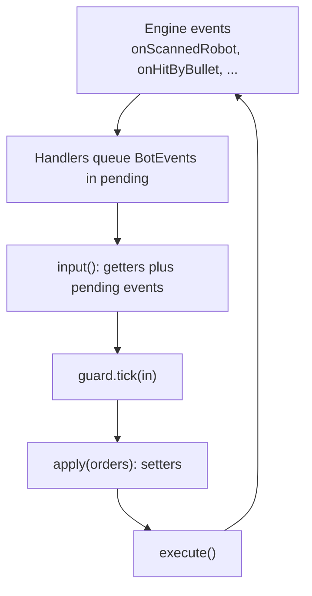

# Hadur's version: the adapter

Read this after the talk. It walks through `hadur2.Hadur`, the one class in Hadur that talks to Robocode, and shows where each idea from the talk lives.

Links are pinned to commits, so they keep showing the code as described. The adapter in its first form, from the commit that introduced the hexagon (S1), is [Hadur.java at afd6cc9](https://github.com/lgriffin/Hadur_Robot/blob/afd6cc9/hadur-robot/src/main/java/hadur2/Hadur.java). The file you will read most closely is the 3.5.1 version, [Hadur.java at a9ee021](https://github.com/lgriffin/Hadur_Robot/blob/a9ee021/hadur-robot/src/main/java/hadur2/Hadur.java).

## The class in one line

```java
public class Hadur extends AdvancedRobot {
```

It is an ordinary Robocode robot. Everything about strategy is somewhere else, in `hadur2.core`. This class translates. Its own Javadoc says so: "All strategy lives in `hadur2.core`; this class only translates."

## Static fields: what survives a round

The first fields in the class are `static`:

```java
private static HadurCore core;
private static Guard guard;
private static PrintStream console;
```

Robocode builds a new `Hadur` object for each round. The learning in `core` has to outlive the object, so it lives in a static. The class comment adds a second point: the core package is forbidden mutable statics by an ArchUnit rule, but the adapter is allowed them, "and here they are the point". You will meet that rule in Topic 05.

## The run loop

`run()` has two parts. The first runs once per round: on round 0 it builds the core, and on every round it calls `core.newRound(...)`, sets colours and turns the three parts of the robot independently. The second part is the `while (true)` loop from the talk.

Per tick the loop does four things, in this order:

1. `input()` builds a `BotInput` from the getters and the queued events.
2. `guard.tick(in)` asks the brain for orders.
3. `apply(orders)` turns the orders into setter calls.
4. `execute()` ends the turn.



## The handlers

Every `onXxx` method is one or two lines. Look at `onScannedRobot`, `onHitByBullet`, `onBulletHit` and `onHitWall`. Each one builds a value and calls `pending.add(...)`. The list is a plain instance field, `private final List<BotEvent> pending`. It is cleared in `input()` once the events have been copied into the `BotInput`.

Why queue instead of acting at once? A handler runs in the middle of `execute()`. Acting there would mix up the order of things. Queuing keeps the engine's event order and gives the brain one complete picture per tick. Topic 03 looks at the values in detail.

## Where to look next

| To see | Open |
|---|---|
| the loop | `run()` |
| orders turned into setters | `apply(BotOrders)` |
| the input built from getters | `input()` |
| one handler per event | `onScannedRobot` to `onSkippedTurn` |
| the end of a round and battle | `onRoundEnded`, `onBattleEnded` |

Some code in the class is outside this topic: the warm-up tick, the profile checkpoints and the timing around the guard. Skip them for now. They come back in Topics 10 and 13.
