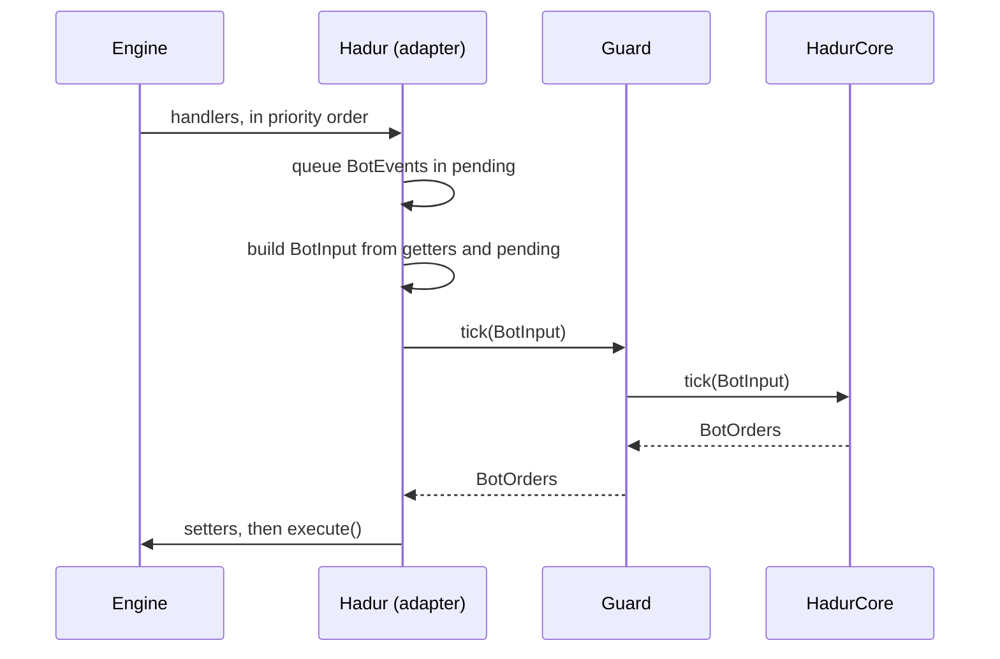

# Hadur's version: the values

Read this after the talk. It walks through the three model classes that carry every tick across the boundary, then shows the tick itself.

Links are pinned to `a9ee021` (3.5.1). The three classes first appeared with the hexagon, in the S1 commit, so the first versions are at `afd6cc9`: [BotInput](https://github.com/lgriffin/Hadur_Robot/blob/afd6cc9/hadur-core/src/main/java/hadur2/core/model/BotInput.java), [BotEvent](https://github.com/lgriffin/Hadur_Robot/blob/afd6cc9/hadur-core/src/main/java/hadur2/core/model/BotEvent.java) and [BotOrders](https://github.com/lgriffin/Hadur_Robot/blob/afd6cc9/hadur-core/src/main/java/hadur2/core/model/BotOrders.java). Compare them with today's to see how a value class grows by adding fields and constructors, never by changing what an old one means.

## BotInput

[BotInput](https://github.com/lgriffin/Hadur_Robot/blob/a9ee021/hadur-core/src/main/java/hadur2/core/model/BotInput.java) holds the time, the round, our position, heading, velocity, energy, gun and radar state, the number of opponents and the list of events.

Things to find in the file:

- two constructors. The first is for a battle without sentries and calls the second with zeros. That is how a class gains fields without breaking its callers
- `List.copyOf(events)`, the defensive copy
- `equals` and `hashCode` over every field

## BotEvent

[BotEvent](https://github.com/lgriffin/Hadur_Robot/blob/a9ee021/hadur-core/src/main/java/hadur2/core/model/BotEvent.java) is an interface with ten nested `final` classes. The class comment explains the two rules from the talk: the set is closed, and the classes are not records because the robot targets Java 11.

Read `Scan` in full, then skim `RobotDeath` and `TickTime`, which are short. Each class has the same parts: final fields, a constructor, accessors, `equals`, `hashCode` and `toString`. It is a lot of repeated code. That repetition is the price of Java 11, and it is why newer Java has records.

`TickTime` shows a neat trick. The core is not allowed to read a clock. So the adapter measures how long the last tick took and hands the number in as an event. Time becomes data, and a replay sees the same time.

## BotOrders

[BotOrders](https://github.com/lgriffin/Hadur_Robot/blob/a9ee021/hadur-core/src/main/java/hadur2/core/model/BotOrders.java) has six doubles, a `Builder`, a `NONE` constant, and an `equals` that uses `Double.compare`. The class comment explains why NaN has to equal NaN.

## The tick

The adapter side is in [Hadur.java](https://github.com/lgriffin/Hadur_Robot/blob/a9ee021/hadur-robot/src/main/java/hadur2/Hadur.java): the handlers add events to `pending`, `input()` builds the `BotInput`, and `apply()` reads the `BotOrders`. The core side is `Guard.tick` and `HadurCore.tick`. The architecture document describes the order of work in its section on [the tick](https://github.com/lgriffin/Hadur_Robot/blob/a9ee021/docs/architecture.md).

## Why bother

Because a tick is two values, a whole battle is a list of pairs. Topic 06 writes that list to a file and replays it. That works only because both classes are immutable and have an `equals` that is correct for doubles.
