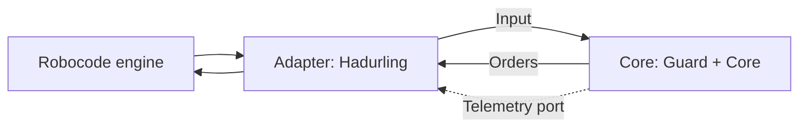

# Why a hexagon

Draw Hadurling as a hexagon. Inside is the brain: all the rules about where to look, where to
drive and when to fire. Outside is the world: the Robocode engine, the console, later files.
Between them are **ports**: small interfaces that say *what the brain needs*, without saying
*how it is done*. On the outside, **adapters** plug into the ports.

The rule that makes it a hexagon: **dependencies point inwards**. The adapter knows the core.
The core never knows the adapter, or the engine.

## What that buys

- **Tests need no engine.** You already tested the `Brain` by calling it. This lab makes that
  permanent.
- **Replay.** A recorded stream of `Input`s can be run through the core on your laptop (Lab 06).
- **Fault injection.** A test can hand the guard a core that throws, to see what happens.
- **Benchmarks.** Later you will run thousands of headless battles, and the core is the same.

## Why a module, not just a package

You could keep one project and promise never to import `robocode` in the `core` packages.
Promises fail. A separate Maven module makes the promise a build fact: `hadurling-core` simply
does not list the Robocode API as a dependency, so `import robocode.*` there is a compile error.
(Lab 05 adds rules for the things the compiler cannot catch.)

Hadur is built exactly this way: the modules `hadur-core` (the brain) and `hadur-robot` (the
adapter).
