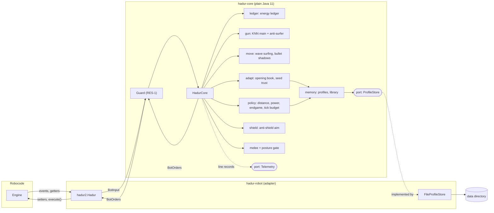
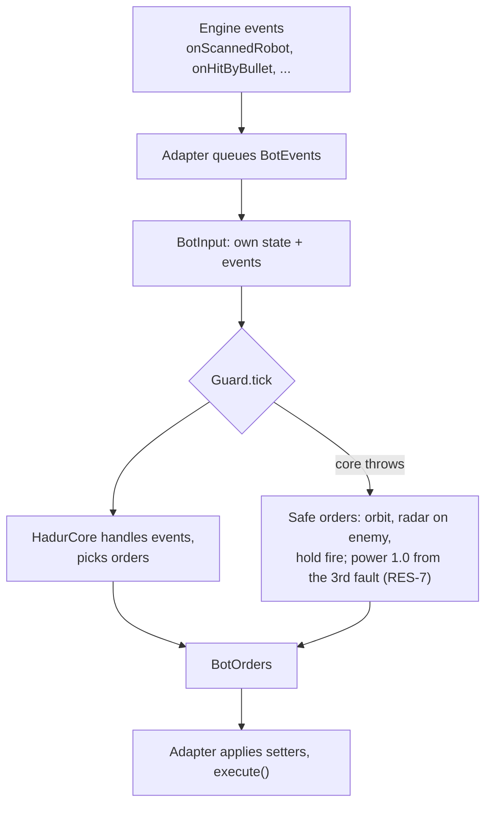
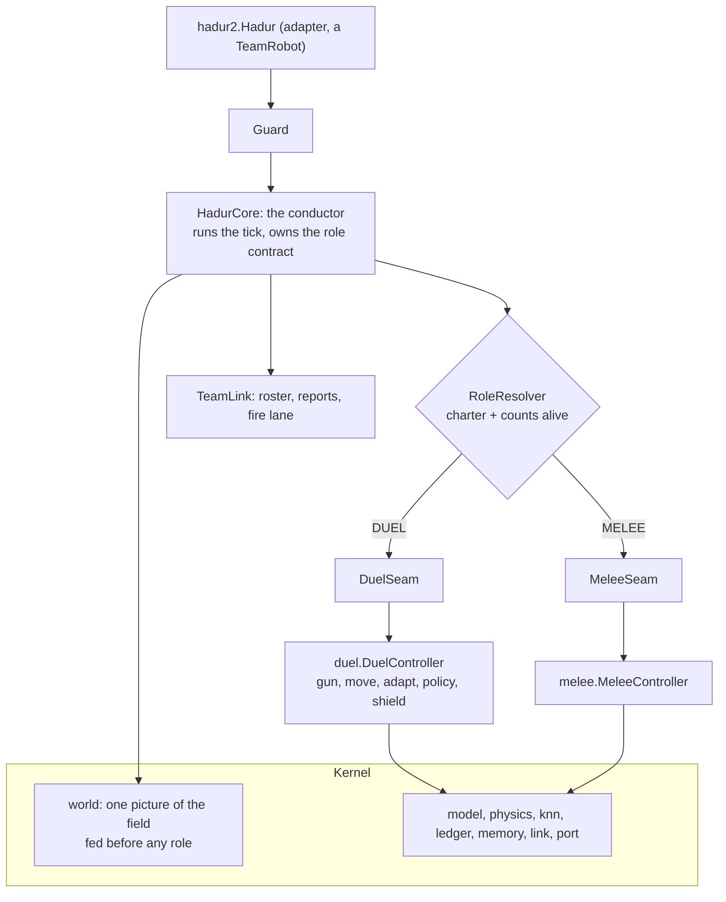

# Hadur's version: the core

Read this after the talks. It maps Hadur's core packages, shows what each may depend on, and points at the classes that make up the boundary.

Links use the S1 commit, `afd6cc9`, where the hexagon, the guard and the replay were introduced, so you see the idea in its first form. `ProfileStore` came with opponent memory in S3, so it and the architecture document use `a9ee021` (3.5.1).

## The hexagon

The diagram is from the project README. The strategy boxes (ledger, gun, move and the rest) are the subject of later topics. For now, look at the edges of the core: `Guard` on the way in, the two ports on the way out.

## The packages of the core

Everything is under `hadur2.core`. The architecture document has the full table. The shape is:

| Package | Role | Depends on |
|---|---|---|
| `model` | the port values: `BotInput`, `BotEvent`, `BotOrders`, waves | itself, physics and the generic kd-tree; never gun, move or replay |
| `physics` | `Angles`, `Rules`, the battle field | the JDK |
| `port` | `Telemetry`, `ProfileStore` | the JDK |
| `ledger` | energy bookkeeping | physics only |
| `gun`, `move` | aiming and movement | the model, physics and the kd-tree; never each other |
| `memory` | opponent profiles | itself and the ports only |
| `replay` | the line codec and replay driver | the model and the core |
| `hadur2.core` | `HadurCore`, `Guard` | everything above |

The right-hand column is not a convention. Topic 05 shows the ArchUnit rules that check it on every build.

## The classes to open

| Class | What to look for |
|---|---|
| [Guard](https://github.com/lgriffin/Hadur_Robot/blob/afd6cc9/hadur-core/src/main/java/hadur2/core/Guard.java) | the `Function<BotInput, BotOrders>` field, the `catch (Throwable t)`, `safeOrders` |
| [GuardTest](https://github.com/lgriffin/Hadur_Robot/blob/afd6cc9/hadur-core/src/test/java/hadur2/core/GuardTest.java) | lambdas as test doubles, one test per behaviour |
| [Telemetry](https://github.com/lgriffin/Hadur_Robot/blob/afd6cc9/hadur-core/src/main/java/hadur2/core/port/Telemetry.java) | a one-method port with a `NONE` constant |
| [ProfileStore](https://github.com/lgriffin/Hadur_Robot/blob/a9ee021/hadur-core/src/main/java/hadur2/core/port/ProfileStore.java) | a port that is "deliberately dumb"; default methods `size` and `lastModified` |
| [Hadur](https://github.com/lgriffin/Hadur_Robot/blob/a9ee021/hadur-robot/src/main/java/hadur2/Hadur.java) | where the ports are plugged in: `new Guard(core::tick, ...)` |
| [architecture.md](https://github.com/lgriffin/Hadur_Robot/blob/a9ee021/docs/architecture.md) | "Modules", "The tick", "Ports and values" |

## One tick through the boundary

The next diagram, also from the README, shows where the guard sits. Follow the "core throws" arrow: it is the only path where the core's answer is replaced.

This version trims the README's diagram to the guard's path. The full one at 3.5.1, with the posture gate and the tick budget, is in [the README at that commit](https://github.com/lgriffin/Hadur_Robot/blob/a9ee021/README.md).

## Since 3.5.1: a second boundary inside the core

Everything above still holds: the adapter, the guard and the two ports are where they were. What changed, in the architecture evolution (stages A0 to A5, releases 3.6 and 3.7), is the inside of the hexagon. At 3.5.1 `HadurCore` was 2,100 lines, two thirds of them the duel, with melee as a delegate. That made a third kind of battle, a team, a third set of branches in every event handler. So the core got a second boundary, between what Hadur *is* and how it fights in each kind of battle.

Three kinds of code, each with one job:

| Kind | Job | In code (3.9) |
|---|---|---|
| Kernel | Hadur's identity: facts, memory, evidence rules. No tactics | `model`, `physics`, `knn`, `ledger`, `memory`, `port`, `world`, `link` |
| Strand | One role's tactics behind one entry class, its brain. A strand never imports another strand | Duel: `duel.DuelController` with `gun`, `move`, `adapt`, `policy`, `shield`. Melee: `melee.MeleeController`. Team: none yet; the team baseline lives in the conductor |
| Conductor | Runs the tick and hands each brain only what it may see | `HadurCore`, `Guard`, `replay`, `role`, the seams, `TeamLink` |

The same ideas as the outer hexagon, applied one level in. The brains are reached through a seam, as the core is reached through the guard. Ownership is checked in the build: [`StrandOwnershipTest`](https://github.com/lgriffin/Hadur_Robot/blob/df731e8/hadur-core/src/test/java/hadur2/core/arch/StrandOwnershipTest.java) reads [`ownership.txt`](https://github.com/lgriffin/Hadur_Robot/blob/df731e8/hadur-core/src/test/resources/ownership.txt), which gives every package exactly one owner. And the move itself was proved by replay: every recorded battle replayed to the same orders, telemetry and data files after the duel was lifted out (A2), which is Topic 06's replay test doing exactly the job it was built for.

Read [`architecture.md`, "Owners: one identity, three strands"](https://github.com/lgriffin/Hadur_Robot/blob/df731e8/docs/architecture.md) for the current table, and the [plan](https://github.com/lgriffin/Hadur_Robot/blob/df731e8/docs/architecture-evolution.md) for why each stage was cut where it was. Topic 14 shows the role resolver that replaced the posture gate.

## Two small things worth noticing

- `ProfileStore` has default methods (`size`, `lastModified`). A port can grow by adding a default method, so existing implementations keep compiling.
- `Guard` takes `Function<BotInput, BotOrders>` rather than a `HadurCore`. In a test it is a lambda. In the robot it is `core::tick`. The guard never learns the difference.
