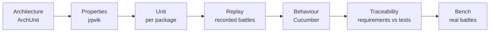

# Hadur's version: the test layers

Read this after the talk. It walks through the layers of Hadur's test suite using the real files, in the order a learner should read them.

Replay and the line codec arrived with the hexagon in S1, so those links use `afd6cc9`. Everything else uses the 3.5.1 commit, `a9ee021`.

## The map

The whole table is in [docs/testing.md](https://github.com/lgriffin/Hadur_Robot/blob/a9ee021/docs/testing.md). Keep it open. This note takes one layer at a time.



The order runs from the cheapest and most general check to the most expensive and most realistic one.

## Properties

Two files show the two kinds of property from the talk.

- [LineCodecProperties](https://github.com/lgriffin/Hadur_Robot/blob/a9ee021/hadur-core/src/test/java/hadur2/core/replay/LineCodecProperties.java) has round trips for orders, inputs and names, and a custom `anyDouble` generator that includes NaN, infinities and negative zero. It also has two `@Example` tests for the sentry fields added later. They show how the codec stays compatible with old fixtures.
- [BulletShadowsProperties](https://github.com/lgriffin/Hadur_Robot/blob/a9ee021/hadur-core/src/test/java/hadur2/core/move/BulletShadowsProperties.java) is a model-based property. The brute-force `collides` method is the slow oracle. The property checks the fast shadow code against it over angles. It uses `net.jqwik.api.Tag`, not JUnit's. The traceability test fails if a jqwik class uses the wrong one, because jqwik would silently skip the test.

[PhysicsMatchesEngineProperties](https://github.com/lgriffin/Hadur_Robot/blob/a9ee021/hadur-core/src/test/java/hadur2/core/physics/PhysicsMatchesEngineProperties.java) from Topic 02 is the third kind: the oracle is the engine.

## The line codec

[LineCodec](https://github.com/lgriffin/Hadur_Robot/blob/afd6cc9/hadur-core/src/main/java/hadur2/core/replay/LineCodec.java) is pure string work. The class comment documents the format, one letter per event type and a colon between fields. Doubles are written with `Double.toString`, which reads back to the same bits.

Read the end of the class comment. It states the rule that lets old recordings keep working: formats only grow by appending optional fields, and a missing trailing field has a default.

## Replay

Three files:

| File | Role |
|---|---|
| [Replay](https://github.com/lgriffin/Hadur_Robot/blob/afd6cc9/hadur-core/src/main/java/hadur2/core/replay/Replay.java) | the driver. It mirrors `hadur2.Hadur`: an `F` line builds a core and guard, `N` starts a round, `I` is an input |
| [Fixtures](https://github.com/lgriffin/Hadur_Robot/blob/afd6cc9/hadur-core/src/test/java/hadur2/core/replay/Fixtures.java) | finds and reads the gzipped fixtures |
| [ReplayTest](https://github.com/lgriffin/Hadur_Robot/blob/afd6cc9/hadur-core/src/test/java/hadur2/core/replay/ReplayTest.java) | one parameterised test per fixture, plus a determinism check that replays twice |

The fixtures live in `hadur-core/src/test/resources/replay/`: three rounds against each of six reference opponents. The testing document explains how they are recorded and when to re-record them.

## Other layers, in one line each

- [ReleaseTargetTest](https://github.com/lgriffin/Hadur_Robot/blob/a9ee021/hadur-core/src/test/java/hadur2/core/release/ReleaseTargetTest.java) opens every compiled class file and reads its major version. Java 11 is 55. It is a good example of a very small test that guards a real failure.
- The `features/` folder has the Cucumber scenarios. Topic 07 covers them.
- [RequirementsTraceabilityTest](https://github.com/lgriffin/Hadur_Robot/blob/a9ee021/hadur-core/src/test/java/hadur2/core/trace/RequirementsTraceabilityTest.java) is Topic 07's subject.

## Try it

```sh
mvn -B -pl hadur-core test -Dtest=ReplayTest
```

Then change one number in `Rules.getBulletSpeed` and run both `PhysicsMatchesEngineProperties` and `ReplayTest`. The properties fail at once. A replay that fails names the fixture, the round and the tick. Put the number back afterwards.
