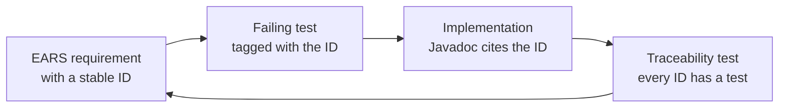

# Hadur's version: requirements as code

Read this after the talk. It walks through the requirements file, the traceability test and the Cucumber features that tie Hadur's behaviour to its requirement IDs.

The traceability test and the first requirements arrived with the hexagon in S1: [requirements.md at afd6cc9](https://github.com/lgriffin/Hadur_Robot/blob/afd6cc9/docs/requirements.md) and [RequirementsTraceabilityTest at afd6cc9](https://github.com/lgriffin/Hadur_Robot/blob/afd6cc9/hadur-core/src/test/java/hadur2/core/trace/RequirementsTraceabilityTest.java). Compare them with the 3.5.1 versions linked below to see how a file grows from a few dozen rows to more than a hundred.

## The requirements file

[docs/requirements.md](https://github.com/lgriffin/Hadur_Robot/blob/a9ee021/docs/requirements.md) opens with the sentence that matters: "This file is the source of truth: every feature file and unit test names the IDs it covers, and IDs never change meaning."

Read it in this order:

1. The main table: ID, pattern, requirement and stage. Find one row of each pattern: CORE-1, MEM-1, DIST-1, WAVE-2 and POW-1.
2. The note below the table about RES-3. It was reworded in S3 "without changing its intent". Rewording is allowed, but changing meaning is not.
3. The **Retired requirements** table. A retired requirement keeps its ID, and no new requirement reuses it.
4. The stage columns. S0 to S7 belong to the duel plan, M0 to M6 to melee, R0 to R9 to the rumble climb.

## The traceability test

[RequirementsTraceabilityTest](https://github.com/lgriffin/Hadur_Robot/blob/a9ee021/hadur-core/src/test/java/hadur2/core/trace/RequirementsTraceabilityTest.java) has four tests:

| Test | Fails when |
|---|---|
| `everyRequirementUpToStageIsCovered` | a requirement due at this build's stage is named by no test |
| `everyTagIsARequirement` | a tag names an ID that is not in the table |
| `jqwikTestsUseJqwikTags` | a jqwik class uses JUnit's `@Tag`, which would make jqwik skip it |
| `requirementsParse` | the table parsed to fewer than 28 rows |

Look at three things in the code:

- the two `Pattern` constants at the top, which are the whole parser
- `due` and `atOrBefore`, which compare a requirement's stage with `hadur.stage`, `hadur.melee.stage` and `hadur.climb.stage` from the root pom
- `writeReport`, which writes the coverage table to `hadur-core/target/requirements-coverage.md`

The javadoc comment on the jqwik check explains a trap. A `@Property` with JUnit's `@Tag` is skipped by jqwik, not failed, and the traceability scan reads source text, so it would count the skipped test as coverage. The extra test closes that gap.

## Cucumber features

Behaviour tests are in `hadur-core/src/test/resources/features/`. Open [waves.feature](https://github.com/lgriffin/Hadur_Robot/blob/a9ee021/hadur-core/src/test/resources/features/waves.feature). Each scenario starts with a tag line such as `@WAVE-1`. The traceability test reads those lines too.

The steps are Java methods in `hadur2.core.steps`. [CucumberTest](https://github.com/lgriffin/Hadur_Robot/blob/a9ee021/hadur-core/src/test/java/hadur2/core/steps/CucumberTest.java) is a JUnit Platform suite that selects the `features` folder and the glue package. It is only a few lines of annotations.

One feature file per group of requirements gives a document a reviewer can read: "Given a core that has scanned the enemy at 100 energy. When the next scan shows the enemy at 98.1 energy. Then one enemy wave of power 1.9 is recorded."

## The loop



The Javadoc in the code cites IDs too, such as "(WAVE-1)" in `Rules` and "(RES-1)" in `Guard`. You can search a requirement ID across the file, the tests and the code, and find everything about it.

## Try it

```sh
mvn -B -pl hadur-core test -Dtest=RequirementsTraceabilityTest
```

Then change one tag in a test, say `@Tag("CORE-1")` to `@Tag("CORE-99")`, and run it again. Read the failure. Put the tag back.
