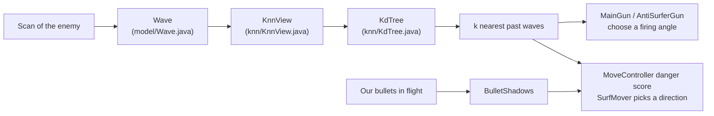

# Hadur's version: waves, KNN views and the surf

Read this after the two talks and before (or after) the lab. It walks through the real classes. The links are pinned to commits, so they keep working when the code moves on.

Two commits are used. `a9ee021` (3.5.1) for the gun, the tree and the wave, and `dd9e419` (S6) for the bullet shadows and the surf as they were first merged.

## The pieces and how they connect



One `Wave` class serves both sides. When we fire, the wave goes from us to the enemy and teaches a gun. When the enemy fires, it goes from the enemy to us and teaches the surf. That is why the Javadoc says a wave is a "firing wave" only when a shot is real.

## Wave: the geometry in one class

[`Wave.java`](https://github.com/lgriffin/Hadur_Robot/blob/a9ee021/hadur-core/src/main/java/hadur2/core/model/Wave.java) holds a snapshot of the target at fire time (distance, speed, wall distances and more), plus the maths from the first talk: `bulletSpeed`, `maxEscapeAngle`, `guessFactor`, `firingAngle`.

Two things to notice as a Java reader.

- The fields are public and mutable. This was ported from the 1.20 code, and the Javadoc says so. It is the opposite of the immutable values in topic 03, and it is allowed here because the core is single-threaded and a wave never leaves it.
- The classic escape angle is `asin(8 / bulletSpeed)`, but the class also has a precise one that simulates the target's escape on each side and accounts for walls. Near a wall the same angle is a bigger guess factor, because the target had less room.

## KdTree: a port with a hand-made heap

[`KdTree.java`](https://github.com/lgriffin/Hadur_Robot/blob/a9ee021/hadur-core/src/main/java/hadur2/core/knn/KdTree.java) is a weighted squared-Euclidean KD-tree, ported from Diamond's. Read the class comment first. It tells you the design in nine lines: bucket leaves that split on the widest weighted axis, a bounding box per node, an optional FIFO size limit.

Compare it with what you build in the lab.

| | Hadurling lab | Hadur |
|---|---|---|
| Tree | `KdTree<T>` in a few dozen lines | one class, every node is a `KdTree`, leaves hold buckets of 24 |
| Best k so far | `PriorityQueue` with a reversed `Comparator` | `ResultHeap`: two parallel arrays, hand-written heap |
| Search | recursive | iterative, with a `status` field per node |
| Bound | none | FIFO size limit (RES-2) |
| Proof | brute-force property test | replay fixtures and `ResourceBoundsTest` |

The iterative search stores its progress in the nodes, so a tree must not be searched by two callers at once. The Javadoc says so. It is safe because the core never uses threads, and the build enforces that (topic 05).

## KnnView: a tree plus a policy

[`KnnView.java`](https://github.com/lgriffin/Hadur_Robot/blob/a9ee021/hadur-core/src/main/java/hadur2/core/knn/KnnView.java) wraps a tree with a feature space (`DistanceFormula`), a size cap and a way to pick k. k grows as the view fills: `size() / kDivisor`, clamped to `kSize`. The tick budget (topic 13) can halve k.

A view is built with fluent setters, and the main gun's view shows the style.

```java
return new KnnView<TimestampedFiringAngle>(new GunFormula(enemiesTotal))
    .setK(K_SIZE).setKDivisor(K_DIVISOR)
    .visitsOn().virtualWavesOn().meleeOn()
    .setName(VIEW_NAME);
```

## MainGun and AntiSurferGun

[`MainGun.java`](https://github.com/lgriffin/Hadur_Robot/blob/a9ee021/hadur-core/src/main/java/hadur2/core/gun/MainGun.java) does not store guess factors. It stores where the target went, as a displacement vector, and replays it. It then fires at the neighbour angle that the most other neighbour angles are near, using a Gaussian kernel whose width is about one robot width at that range. This keeps walls in the picture and works in melee.

[`AntiSurferGun.java`](https://github.com/lgriffin/Hadur_Robot/blob/a9ee021/hadur-core/src/main/java/hadur2/core/gun/AntiSurferGun.java) is the guess-factor gun. It keeps four small views that forget fast (125, 400, 1,500 and 4,000 waves), because a surfer moves away from what it has seen. `GunController` picks between the two by virtual-gun ratings, or from the first wave when the opening book says so.

So your lab's `GuessFactorGun` is closest to the anti-surfer gun, and Hadur's main gun is the next step on from it.

## SurfMover: three options and a danger number

[`SurfMover.java`](https://github.com/lgriffin/Hadur_Robot/blob/dd9e419/hadur-core/src/main/java/hadur2/core/move/SurfMover.java) (shown at S6) rates three options, clockwise, counter-clockwise and stop, with `checkDanger`. The talk quoted `waveDanger`. Read `checkDanger` for the lookahead and the `cutoff` pruning.

The danger itself comes from [`MoveController`](https://github.com/lgriffin/Hadur_Robot/blob/a9ee021/hadur-core/src/main/java/hadur2/core/move/MoveController.java) `getDangerScore`: a kernel-weighted average over the nearest past waves, with a fixed fallback when no view has data.

## BulletShadows: geometry with a brute-force twin

[`BulletShadows.java`](https://github.com/lgriffin/Hadur_Robot/blob/dd9e419/hadur-core/src/main/java/hadur2/core/move/BulletShadows.java) is a static class of pure functions (the constructor is private). Input: an enemy wave and our bullets in flight. Output: two lists of bearing intervals, the certain shadow and the possible one.

Its twin is [`BulletShadowsProperties.java`](https://github.com/lgriffin/Hadur_Robot/blob/dd9e419/hadur-core/src/test/java/hadur2/core/move/BulletShadowsProperties.java). It flies an enemy bullet at many angles and our bullet turn by turn, with `Line2D.linesIntersect`, and requires the angles that collide to be exactly the shadows. That is the model-based property from topic 06: a fast clever version checked against a slow obvious one.

The S6 notes in `docs/strategy-evolution.md` say it took three rounds of fixing the geometry against the engine's truth logs to get there (35%, then 83%, then 100% of destroyed enemy bullets inside a computed shadow).

## Try this

1. Open `KdTree.nearestNeighbor` and find the line that sets `range`. Say in one sentence what would break if `range` stayed infinite.
2. In `MainGun.aim`, find where a faded seed (weight 0) is skipped. Which requirement is the comment citing?
3. In `SurfMover.waveDanger`, change nothing, but predict: if the enemy fires power 0.1 shots only, what happens to the sizes of the three option dangers?
