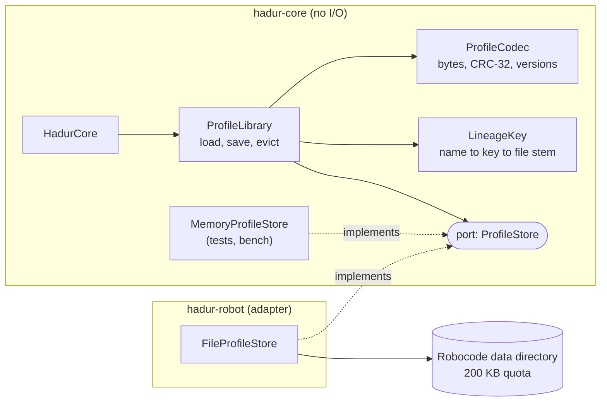

# Hadur's version: opponent memory

Memory is spread over four places: the format (`ProfileCodec`), the library that decides when and how to save (`ProfileLibrary`), a port (`ProfileStore`) with a test double, and an adapter on Robocode's data directory (`FileProfileStore`). This note walks through them at stage S3, when memory first merged (`a844960`), then says what R8 changed.



## The port

[`ProfileStore`](https://github.com/lgriffin/Hadur_Robot/blob/a844960/hadur-core/src/main/java/hadur2/core/port/ProfileStore.java) is six methods: `read`, `write`, `delete`, `names`, `bytesUsed`, `quota`. Its comment says "the port is deliberately dumb". It does not know what the bytes mean. A write may be cut short. Any method may throw an unchecked exception, and the core treats that as a failed load or save, never as fatal.

That last choice matters. Checked exceptions on a port would force every caller in the core to handle I/O. Unchecked ones let the library catch `RuntimeException` in one place and turn it into a counter.

## The format

[`ProfileCodec`](https://github.com/lgriffin/Hadur_Robot/blob/a844960/hadur-core/src/main/java/hadur2/core/memory/ProfileCodec.java) writes `'H' 'P'`, a version byte, a payload length, the payload and a CRC-32 over everything before it. The payload order is spelled out in the Javadoc of `encode`. `decode` checks cheapest things first and range-checks every count, so no input, however damaged, makes it throw anything but `ProfileFormatException`.

Two Java points for this topic.

- The core cannot use `java.io`, so it has its own `Bytes.Writer` and `Bytes.Reader`. Floats go in as `Float.floatToIntBits`, so NaN and infinity stay distinct and a value reads back bit for bit.
- `CRC32` is in `java.util.zip`, which is not I/O, so the core may use it.

Tests: [`ProfileCodecProperties`](https://github.com/lgriffin/Hadur_Robot/blob/a844960/hadur-core/src/test/java/hadur2/core/memory/ProfileCodecProperties.java) has a round-trip property, random bytes never throw anything else, every truncation is rejected, every single bit flip is rejected, and a valid CRC over bad values is still rejected. Read all five. They are the template for lab 10.

## The library

[`ProfileLibrary`](https://github.com/lgriffin/Hadur_Robot/blob/a844960/hadur-core/src/main/java/hadur2/core/memory/ProfileLibrary.java) owns the policy. Its class comment lists the requirements it meets (MEM-1 to MEM-5, RES-3). The write order is three lines:

```java
private void writeAtomically(String file, byte[] bytes) {
    store.write(file + TMP_SUFFIX, bytes);
    store.write(file, bytes);
    store.delete(file + TMP_SUFFIX);
}
```

It also keeps a battle counter file so each profile can be stamped with "when last fought", and when a save would pass 90% of the quota it drops the seeds of the least recently fought profiles first. Ties are broken by key, so the order is deterministic (CORE-2).

Nothing in the library throws. Every failure becomes a counter and a note, and the core copies the counters into each round's record (RES-5).

## The test double

[`MemoryProfileStore`](https://github.com/lgriffin/Hadur_Robot/blob/a844960/hadur-core/src/main/java/hadur2/core/port/MemoryProfileStore.java) enforces a quota the way Robocode does and has `crashAfter(bytes)`, which keeps only a prefix of the next write and then throws a `Crash`. [`ProfileLibraryTest.killedAtEveryByte`](https://github.com/lgriffin/Hadur_Robot/blob/a844960/hadur-core/src/test/java/hadur2/core/memory/ProfileLibraryTest.java) arms it at every byte of both writes of a save, then loads and requires a profile that is either the old one or the new one.

The same test exists against the real adapter in `FileProfileStoreTest` (also `killedAtEveryByte`), so the double is not trusted blindly.

## The adapter

[`FileProfileStore`](https://github.com/lgriffin/Hadur_Robot/blob/a844960/hadur-robot/src/main/java/hadur2/FileProfileStore.java) is the only class that touches Robocode's `RobocodeFileOutputStream`. Its `delete` empties the file before deleting it, because Robocode refunds the length of a file you reopen for writing but nothing for a delete (learning L-16 in `data/learnings.md`).

It takes an `opener` (a small functional interface), so tests can substitute a plain stream. That is the same trick as the port, one level down.

## What R8 changed

At 3.4 (commit `04f63e9`) the store gained `size(name)` and `lastModified(name)`, and `FileProfileStore` keeps an index it builds with one directory listing per battle. [`ProfileStore` at R8](https://github.com/lgriffin/Hadur_Robot/blob/04f63e9/hadur-core/src/main/java/hadur2/core/port/ProfileStore.java) shows the two new default methods. Topic 13 tells the story of why.

## Profiles are not only stats

[`LineageKey`](https://github.com/lgriffin/Hadur_Robot/blob/a844960/hadur-core/src/main/java/hadur2/core/memory/LineageKey.java) is worth reading for its edge-case handling: a null name, a 500-character name, a name with no package, `"x (1) (2)"`. It is plain string work and a good model for lab code that must never throw on odd input.

## Try this

1. In `decode`, find the line that stops a corrupt length field from sizing a large buffer.
2. A profile file is cut at byte 100. List which checks in `decode` would catch it, in order.
3. Version 3 adds one more count group. Write down the three places you would change, and the test you would add first.
