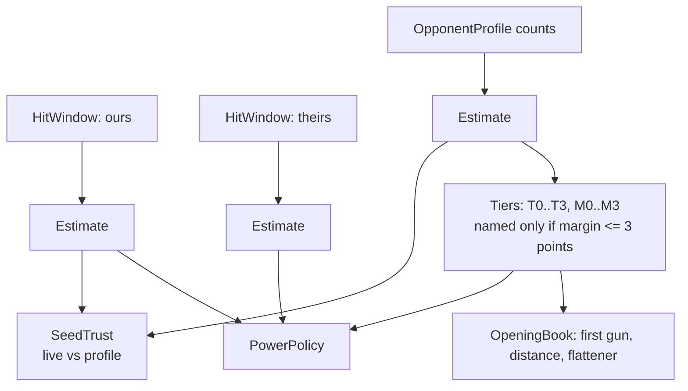

# Hadur's version: estimates, tiers and power

Four small classes carry the whole idea: `Estimate`, `HitWindow`, `PowerPolicy` and `SeedTrust`. They are pure code with no engine types, which is why they are easy to test and easy to read.

Commits used: `6ecfcd4` (S4) for `Estimate` and `SeedTrust`, `a2c571e` (S5) for `HitWindow` and the first `PowerPolicy`, and `17f0d4e` (R2) for the corrected `PowerPolicy`.

## How the pieces connect

## Estimate

[`Estimate.java`](https://github.com/lgriffin/Hadur_Robot/blob/6ecfcd4/hadur-core/src/main/java/hadur2/core/memory/Estimate.java) is an immutable value class: private constructor, static factory `of`, one shared constant `NONE`. Read the Javadoc table of `value`, `center` and `margin`. The three are different on purpose. A bound that must hold with 95% confidence is `center() +- margin()`, because the raw value can sit at 0 or 1, at the edge of an interval that is not centred on it.

Two small habits worth copying.

- `of` returns `NONE` for any input that is not a positive finite count. No exception, no NaN leaking out.
- `within(threshold)` is false for `NONE`, whatever the threshold. "Unknown" never passes a gate.

Tests: [`EstimateTest`](https://github.com/lgriffin/Hadur_Robot/blob/6ecfcd4/hadur-core/src/test/java/hadur2/core/memory/EstimateTest.java).

## HitWindow

[`HitWindow.java`](https://github.com/lgriffin/Hadur_Robot/blob/a2c571e/hadur-core/src/main/java/hadur2/core/policy/HitWindow.java) is a ring buffer of booleans with a running hit count. `HadurCore` keeps two: ours and theirs. They are cleared when a different robot becomes the duel opponent. `MoveFlavour` keeps its own, cleared at each change of flavour.

This is the "bounded collection" idea from topic 13 in its smallest form: capacity fixed at construction, no allocation after that.

## Tiers and the opening book

[`Tiers.java`](https://github.com/lgriffin/Hadur_Robot/blob/6ecfcd4/hadur-core/src/main/java/hadur2/core/memory/Tiers.java) turns estimates into enum tiers, and only while the margin is at most `MAX_MARGIN` (0.03). The gun-tier bounds (2%, 4.5%, 7%) were set from bench logs: sample bots read T0 and Shadow T3. Read the Javadoc on `GUN_BOUNDS` for the story of why the plan's first guesses were changed.

[`OpeningBook.java`](https://github.com/lgriffin/Hadur_Robot/blob/6ecfcd4/hadur-core/src/main/java/hadur2/core/adapt/OpeningBook.java) is a pure function of a profile. It takes no tick, round or clock (DIAL-2). An unknown tier selects 1.20's behaviour.

## PowerPolicy, twice

The first version, [at S5](https://github.com/lgriffin/Hadur_Robot/blob/a2c571e/hadur-core/src/main/java/hadur2/core/policy/PowerPolicy.java), had two reasons: `POW_1` (a T0 gun) and `POW_2` (a certain lead). The version [at R2](https://github.com/lgriffin/Hadur_Robot/blob/17f0d4e/hadur-core/src/main/java/hadur2/core/policy/PowerPolicy.java) adds `POW_3`, `POW_4`, the T3 cap and `leastPowerThatKills`.

Read three things there.

1. `reason(...)` is a chain of guard clauses in a fixed order, and returns an `enum`. The decision and the power are separate: `power(reason, gunPower, enemyEnergy)` turns the reason into a number.
2. The Javadoc of `POW_4_MARGIN`. It explains how a rule passed its tests and could never fire. The tests that fixed it are in [`PowerPolicyTest`](https://github.com/lgriffin/Hadur_Robot/blob/17f0d4e/hadur-core/src/test/java/hadur2/core/policy/PowerPolicyTest.java), starting at `aFullHitWindowReachesTheGate`.
3. `expectedValue` and the comment on convexity: because the damage curve is convex, the best power is always an end of the range, so checking two values is enough.

## SeedTrust

[`SeedTrust.java`](https://github.com/lgriffin/Hadur_Robot/blob/6ecfcd4/hadur-core/src/main/java/hadur2/core/adapt/SeedTrust.java) holds a `SeedWeight` and fades it. Its property test [`SeedTrustProperties`](https://github.com/lgriffin/Hadur_Robot/blob/6ecfcd4/hadur-core/src/test/java/hadur2/core/adapt/SeedTrustProperties.java) says the weight never rises and twenty divergent waves empty it, for any sequence of live estimates.

The DIAL-3 comment in `diverges` is a good example of defensive code with a reason: a non-finite margin must not read as "no divergence". It cannot happen today. The guard is there so it cannot happen silently.

## The numbers behind the thresholds

From `docs/strategy-evolution.md`:

- DIST-1 comes in 25 px only while our rate leads theirs by 5 points after subtracting the margin. A first version let one cold battle walk in to 175 px on noise.
- The distance floor moved from 150 to 400 px because at 150 px sample bots' head-on guns hit Hadur often enough to cost 0.4 to 2 points.
- In one bench battle Shadow's live hit rate climbed to 12.5% against a stored 9.5%, and the surf seed faded as designed.

## Try this

1. Compute `Estimate.of(3, 100).margin()` by hand and check it against the test in `PowerPolicyTest` that uses `Estimate.of(3, 100)`.
2. In `PowerPolicy.reason`, move the POW-4 clause above POW-1. Which existing test fails first, and what does that tell you about the order?
3. Write the property that `SeedTrust` weight never rises in your own words, then find the line that makes it true.
