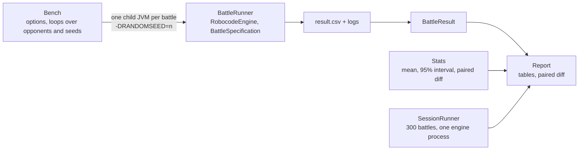

# Hadur's version: hadur-bench

The bench is its own Maven module, `hadur-bench`. It is not part of the robot's jar, it uses the real Robocode engine from Maven Central, and the robot's core never depends on it. Three classes carry the idea.

Commits used: `5d54b9e` (S0, the first bench) and `a9ee021` (3.5.1) for what it grew into, and `e53c8f5` (R7) for the session runner.

## Bench: the loop

[`Bench.java` at S0](https://github.com/lgriffin/Hadur_Robot/blob/5d54b9e/hadur-bench/src/main/java/hadur/bench/Bench.java) is where the options are parsed and the loops live: for each opponent, for each seed, wipe the data directory (cold), run the battle, collect the result. The [3.5.1 version](https://github.com/lgriffin/Hadur_Robot/blob/a9ee021/hadur-bench/src/main/java/hadur/bench/Bench.java) adds warm mode, `--melee`, `--client`, `--suite` and the paired A/B.

Read `runBattle`. It builds a command line for a child JVM and starts it with `ProcessBuilder`, gives it a 30-minute timeout, and reads the child's `result.csv`. A battle that fails still produces a row (`BattleResult.failed(...)`), so one bad battle shows up in the report instead of killing the run.

## BattleRunner: the engine, headless

[`BattleRunner.java`](https://github.com/lgriffin/Hadur_Robot/blob/5d54b9e/hadur-bench/src/main/java/hadur/bench/BattleRunner.java) has a `main` and under 90 lines. It builds a `RobocodeEngine` on a Robocode home directory, adds a `BattleAdaptor` that collects results, runs the battle, writes the CSV and exits. The exit code says what went wrong (2 for the wrong number of robots, 3 for no results).

The engine reports missing GUI support as an error even when headless. The listener ignores exactly those messages and keeps the rest. Small, specific, and written down.

## Stats: the whole statistical toolkit

[`Stats.java`](https://github.com/lgriffin/Hadur_Robot/blob/a9ee021/hadur-bench/src/main/java/hadur/bench/Stats.java) is 100 lines. `Stats.of` is the mean and Student's t interval for a small sample, with a table of the 97.5th percentiles for 1 to 30 degrees of freedom. `Stats.pairedDiff` pairs index for index, over the shared length only. `Stats.weighted` is the stratified estimate for the rumble sample (BENCH-1).

Its test, [`StatsTest`](https://github.com/lgriffin/Hadur_Robot/blob/a9ee021/hadur-bench/src/test/java/hadur/bench/StatsTest.java), is a good model for the lab. Look at `pairedDiffCancelsCommonNoise`: both jars are 0.1 higher on one seed, and the diff must not see it.

## Report: the table the gate is read from

[`Report.java`](https://github.com/lgriffin/Hadur_Robot/blob/a9ee021/hadur-bench/src/main/java/hadur/bench/Report.java) renders the Markdown tables you see in `docs/bench/`. Score share, survival share and bullet-damage share all come from one helper in `BattleResult`, `share(a, b)`, which returns 0.5 when both are zero. The report's closing paragraph says where each number comes from, so a reader can tell a harness measurement from the robot's own record.

## Reading a real report

Open [`docs/bench/m6-gates.md`](https://github.com/lgriffin/Hadur_Robot/blob/6a33109/docs/bench/m6-gates.md). It has all the habits in one page.

1. A summary against the plan's gate, with "not met" written where it applies.
2. The raw numbers, with the conditions (rounds, seeds, engine, Java, cores, CPU constant).
3. A sweep table where each row is one build and the baseline is run twice to show the noise.
4. A correction to an earlier report ("A correction to the M5 report").
5. A list of what was not done.

## The session runner

[`SessionRunner.java`](https://github.com/lgriffin/Hadur_Robot/blob/e53c8f5/hadur-bench/src/main/java/hadur/bench/SessionRunner.java) came with R7. It runs hundreds of battles in one engine process, with a control robot beside Hadur, because a rumble client does the same. The comparison with the control is what made the skipped-turn growth believable: Hadur's grew, the control's stayed at zero.

## Try this

1. Find where `Bench` passes the seed to the child JVM. What would happen to repeatability if it did not?
2. Run `Stats.of` by hand on the five numbers 0.55, 0.60, 0.58, 0.52, 0.61. What is the half-width, and which t value is used?
3. Open `docs/bench/s6-2.1-shadow-goto-cold.md` and `docs/bench/s6-2.1-shadow-options-cold.md`. Decide whether go-to surfing lost its A/B (51.8% ± 5.1 against 54.8% ± 3.7) outside the noise. Then say what a paired run would have told you that two unpaired ones cannot.
