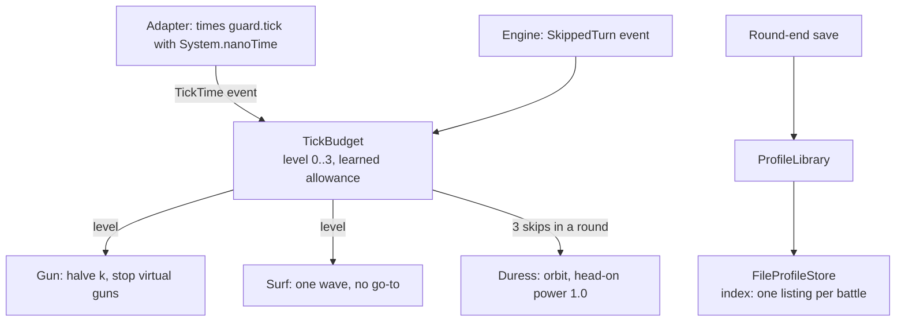

# Hadur's version: tick budget, duress and the index

Three layers handle time and growth. The tick budget sheds work. Duress is the last resort. The index in `FileProfileStore` keeps a save cheap however many opponents are on disk.

Commits used: `dd9e419` (S6) for the first `TickBudget`, `e53c8f5` (R7) for `Duress` and the session bench, `04f63e9` (R8, release 3.4) for the index.

## The adapter times, the core decides

Open [`Hadur.java`](https://github.com/lgriffin/Hadur_Robot/blob/e53c8f5/hadur-robot/src/main/java/hadur2/Hadur.java) and find the `while (true)` loop in `run()`. It reads `System.nanoTime()` before and after `guard.tick(in)` and passes the difference to the next tick as a `BotEvent.TickTime`.

Two reasons for `nanoTime` and not `currentTimeMillis`: it is monotonic, so it never runs backwards when the wall clock is corrected, and it has far finer resolution. A tick is about a millisecond.

Only the guarded core call is timed, because that is what the budget can change. The cost of this choice is in `TickBudget.skippedTurn()`: a skip can follow a short measured tick, so a learned allowance below 20% of the guess is not trusted.

## TickBudget

[`TickBudget.java` at S6](https://github.com/lgriffin/Hadur_Robot/blob/dd9e419/hadur-core/src/main/java/hadur2/core/policy/TickBudget.java) is the first version: levels 0 to 3, the 70% threshold, a skipped turn holding a level for the round. The [R7 version](https://github.com/lgriffin/Hadur_Robot/blob/e53c8f5/hadur-core/src/main/java/hadur2/core/policy/TickBudget.java) adds learning the real allowance (TIME-3, from R1) and `duress()` (RES-9).

The four static methods at the bottom (`wavesToSurf`, `goToAllowed`, `kShare`, `virtualGuns`) are the whole policy for what each level means. Everything else in the class is bookkeeping about when to change level. That split makes it easy to change the policy without touching the bookkeeping.

[`TickBudgetTest`](https://github.com/lgriffin/Hadur_Robot/blob/e53c8f5/hadur-core/src/test/java/hadur2/core/policy/TickBudgetTest.java) has one test per behaviour: `slowTickShedsOneTick`, `skippedTurnsHoldForTheRound`, `levelsShedInOrder`, `noAllowanceNoShedding`, `firstSkipLearnsTheRealAllowance`, `implausiblyTinyMeasurementIsNotLearned`. Read the names. They are the specification.

## Duress

[`Duress.java`](https://github.com/lgriffin/Hadur_Robot/blob/e53c8f5/hadur-core/src/main/java/hadur2/core/Duress.java) is 135 lines and runs nothing that grows or searches. It uses a seeded xorshift generator so its pseudo-random reversals still replay exactly. Hadur's rule is no unseeded randomness in the core (RES-6), not no randomness.

The test [`DuressTest`](https://github.com/lgriffin/Hadur_Robot/blob/e53c8f5/hadur-core/src/test/java/hadur2/core/DuressTest.java) covers the transition (the third skip, and leaving with the round), firing only when the gun is cool and aimed, and a stale enemy position sweeping the radar and holding fire.

## The session bench and what it found

[`SessionRunner.java`](https://github.com/lgriffin/Hadur_Robot/blob/e53c8f5/hadur-bench/src/main/java/hadur/bench/SessionRunner.java) runs hundreds of battles in one engine process. Read [`docs/bench/r7-session.md`](https://github.com/lgriffin/Hadur_Robot/blob/a9ee021/docs/bench/r7-session.md) for the tables and [`docs/skipped-turns-plan.md`](https://github.com/lgriffin/Hadur_Robot/blob/a9ee021/docs/skipped-turns-plan.md) for the review that checked the evidence against the raw logs and the engine source. That plan lists four corrections to the first diagnosis. A good example of a second reader earning their keep.

## The index

[`FileProfileStore` at R8](https://github.com/lgriffin/Hadur_Robot/blob/04f63e9/hadur-robot/src/main/java/hadur2/FileProfileStore.java) builds its index lazily in `index()`: `if (index == null) adopt(list(dir))`. After that, `write` and `delete` update the map and `size`, `lastModified`, `names` and `bytesUsed` read from it.

It uses `java.io.File.listFiles()` and `f.length()`, not `java.nio.file`. Robocode's sandbox restricts what a robot can do, and the adapter stays inside it. The lab uses `java.nio.file`.

Notice the one-line comment on `adopt`: later writes are stamped after the newest listed file, using a logical clock, so `lastModified` orders writes without trusting the file system's resolution.

[`ProfileStore` at R8](https://github.com/lgriffin/Hadur_Robot/blob/04f63e9/hadur-core/src/main/java/hadur2/core/port/ProfileStore.java) gained two `default` methods, `size` and `lastModified`. A default method let the in-memory test store and old callers keep working.

In [`ProfileLibrary`](https://github.com/lgriffin/Hadur_Robot/blob/04f63e9/hadur-core/src/main/java/hadur2/core/memory/ProfileLibrary.java) find `STATS_ONLY_MAX` (MEM-12) and `forgetOldest` (MEM-13).

The test is [`FileProfileStoreTest.listsOnce`](https://github.com/lgriffin/Hadur_Robot/blob/04f63e9/hadur-robot/src/test/java/hadur2/FileProfileStoreTest.java). It plants a file behind the store's back and checks the store does not see it, which proves nothing listed again.

## The R8 bench

[`docs/bench/r8-memory-scale.md`](https://github.com/lgriffin/Hadur_Robot/blob/04f63e9/docs/bench/r8-memory-scale.md) has the table: with a 698-profile directory at a 1 ms client constant, 3.3 skipped 188 to 224 turns per battle and 3.4 skipped 10 to 26.

It also records a change that was tried and dropped (TIME-6, calling `execute()` ahead of the battle set-up), with the numbers that killed it. Writing down what did not work is part of the method.

## Try this

1. In `TickBudget.tickTook`, find the line that makes an unknown allowance never shed. Why is that the safe choice?
2. A rumble client has hit 2,000 opponents. Which of `ProfileLibrary`'s methods still scale with that number, and which no longer do?
3. Write the property you would use to show that `forgetOldest` frees at least `needed` bytes when it can.
