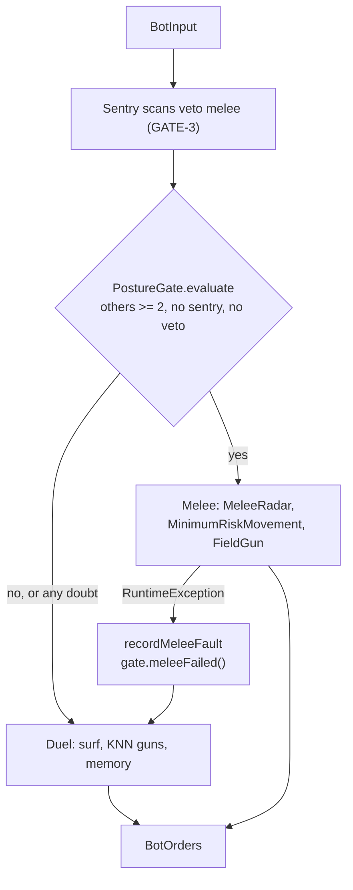

# Hadur's version: the posture gate and the melee brain

Melee has no lab. This note is fuller than the others for that reason. It is a reading guide to four things: the posture gate that fails closed, the test that keeps the duel untouched, minimum-risk movement, and the field gun. It ends with the M6 bench table.

Commits used: `94deb10` (M0 and M1, the gate), `c1ec5c7` (M3, minimum risk), `6a33109` (M6, release 3.0). For `docs/architecture.md`, "Melee and duel", read the section of that name alongside this note.



## 1. The gate that fails closed

[`PostureGate.java`](https://github.com/lgriffin/Hadur_Robot/blob/94deb10/hadur-core/src/main/java/hadur2/core/posture/PostureGate.java) is 67 lines. Read the class comment, then `evaluate`:

```java
public Posture evaluate(int others, int numSentries) {
    return others >= 2 && numSentries == 0 && veto == Veto.NONE
        ? Posture.MELEE : Posture.DUEL;
}
```

The three vetoes live in a small enum: `NONE`, `SENTRY`, `FAULT`. A sentry or a fault sets one and it stays until `newRound()`. The first veto wins: `sentryScanned` only sets `SENTRY` when the veto is `NONE`, and `meleeFailed` always sets `FAULT`, so a fault is never hidden by a later sentry.

The tests, [`PostureGateTest`](https://github.com/lgriffin/Hadur_Robot/blob/94deb10/hadur-core/src/test/java/hadur2/core/posture/PostureGateTest.java), have one `@Test` per requirement, each tagged `GATE-1` to `GATE-5` and `RES-2`. Their `@DisplayName` strings read as the requirement. Two to notice:

- "a sentry alive keeps the duel, whatever the opponent count", then, on the next line, that a sentry's absence restores melee. The count is re-read every tick; only the scan-based veto is sticky.
- "the sentry names are bounded": a thousand sentry names are offered and only 32 are kept.

### Where it is used

In [`HadurCore.tick`](https://github.com/lgriffin/Hadur_Robot/blob/94deb10/hadur-core/src/main/java/hadur2/core/HadurCore.java) look for `gate.evaluate(...)` (line 274 at M1) and the `try`/`catch (RuntimeException ex)` around `meleeTick` that calls `meleeFailed`. That method:

1. records the fault and tells the gate,
2. sets the posture to `DUEL` for this same tick,
3. resets the duel's tracking so it starts from a clean slate,
4. returns fresh orders so a half-built melee order cannot leak into the duel's.

There is also a handoff in the other direction. When melee ends with one opponent left, the duel starts fresh (MELEE-2) and takes the survivor's profile and shots in flight (MMEM-1, MMEM-2).

### Two supporting classes

[`SentryFence`](https://github.com/lgriffin/Hadur_Robot/blob/94deb10/hadur-core/src/main/java/hadur2/core/posture/SentryFence.java) treats a sentry's border as a wall for the duel's movement: it simulates the robot 12 ticks ahead and, if the orders would come within 30 px (plus half a robot) of the border zone, replaces them with a drive to the centre. [`DuelFocus`](https://github.com/lgriffin/Hadur_Robot/blob/94deb10/hadur-core/src/main/java/hadur2/core/posture/DuelFocus.java) keeps the duel's attention on one opponent while several are alive and melee is vetoed.

A side note on names. There are two enums called `Posture`. `posture.Posture` is `DUEL` or `MELEE` and is the gate's output. `melee.MeleeStrategy.Posture` is `NORMAL`, `LET_THEM_FIGHT`, `LOW_PROFILE` or `AGGRESSIVE`, and lives inside the melee brain. They answer different questions.

## 2. "1v1 is sacred": DuelIdentityTest

[`DuelIdentityTest.java`](https://github.com/lgriffin/Hadur_Robot/blob/94deb10/hadur-core/src/test/java/hadur2/core/arch/DuelIdentityTest.java) hashes the source of every file in nine packages (adapt, gun, knn, ledger, memory, move, physics, policy, shield) and compares with a stored list, [`duel-sources.sha256`](https://github.com/lgriffin/Hadur_Robot/blob/94deb10/hadur-core/src/test/resources/duel-sources.sha256), one SHA-256 and path per line (48 files at M1).

Notes on the Java:

- It hashes **sources**, not class files, because class bytes change with the JDK that compiles them. Line endings are normalised first, so Windows and Linux agree.
- `MessageDigest.getInstance("SHA-256")` and a `StringBuilder` turn bytes into hex.
- The failure message lists `added`, `edited` or `removed` per file, so you know what changed.
- Re-pinning is a deliberate act: run the test with `-Dhadur.duel.snapshot=write`. The comment says only a duel stage may do it, never a melee one.

This is a **change detector**. It does not say the duel is right; the replay fixtures and the bench say that. It says the duel is the same duel the bench measured.

## 3. Minimum-risk movement

[`MinimumRiskMovement.java`](https://github.com/lgriffin/Hadur_Robot/blob/c1ec5c7/hadur-core/src/main/java/hadur2/core/melee/MinimumRiskMovement.java) (shown at M3) is 499 lines in the current version. Read in this order.

1. The class comment: the risk terms in a list.
2. The constants block. Each weight is a `static final` with a short name (`CLOSEST_FACTOR`, `BULLET_K`, `WALL_K`). Nothing is hidden in the code.
3. `candidates(...)`: 32 angles by 5 rings (160 points), staggered so points do not line up, the ring capped at 80% of the nearest opponent's distance so Hadur never runs into anyone, then clipped to the field.
4. `risk(p, v)`: the sum. `enemyRisk` is `UNIT * freshness * energyRatio / (d * d)`, times the closest-robot factor, times a lateral factor.
5. `chooseDestination`: a loop, then the hysteresis rule. The current destination is kept until a new point is at least 10% safer (`SWITCH_GAIN = 0.9`), which stops the robot dithering between two similar points.

Two quiet design choices. Everything is deterministic: the "noise" term is a hash of the position (`NOISE_CELL`), not a random number, so replays hold. And `MAX_BULLETS = 128` bounds the list of virtual bullets (RES-2).

Tests: [`MinimumRiskMovementTest`](https://github.com/lgriffin/Hadur_Robot/blob/c1ec5c7/hadur-core/src/test/java/hadur2/core/melee/MinimumRiskMovementTest.java), plus `MinimumRiskMovementProperties` in the current tree.

## 4. The field gun

[`FieldGun.java`](https://github.com/lgriffin/Hadur_Robot/blob/6a33109/hadur-core/src/main/java/hadur2/core/melee/FieldGun.java) is Shadow's melee gun, as Diamond and Neuromancer use it. Each recently scanned opponent gets `K = 3` solutions: its three most similar past situations (from `EnemyHistory`, via a `KdTree`) played forward until a bullet would reach it. Each solution has an angle, a tolerance (half the robot's width at that range) and a weight.

`aim(...)` sums the weights of every solution whose angle is within another's tolerance and takes the peak. The weight (`weight(...)`) is 100 over the distance (at least 50), leaning toward weak opponents, doubled for a finisher at 16 energy or less (MGUN-2), 1.3 for an isolated opponent and 1.5 for one that has hit Hadur twice in 200 ticks.

Look at the double loop in `aim`. It is O(n squared) in the number of solutions, at most 9 opponents times 3. This is a place where the simple algorithm is the right one.

Tests: [`FieldGunTest`](https://github.com/lgriffin/Hadur_Robot/blob/6a33109/hadur-core/src/test/java/hadur2/core/melee/FieldGunTest.java) (the MGUN tags), including `finisherWeight` and `rammers`.

## 5. The M6 bench table

From [`docs/bench/m6-gates.md`](https://github.com/lgriffin/Hadur_Robot/blob/6a33109/docs/bench/m6-gates.md), the reference field (nine established melee bots), cold, 1000 by 1000, 35 rounds by 10 seeds.

| Robot | Mean place | Score share | Firsts |
|---|---|---|---|
| rz.Aleph 0.34 | 1.1 | 13.2% | 76 |
| darkcanuck.B26354 1.06 | 3.2 | 11.3% | 57 |
| **hadur2.Hadur 3.0** | **4.7** | **10.7%** | **32** |
| abc.Tron 2.02 | 5.1 | 10.6% | 43 |
| kawigi.sbf.FloodHT 0.9.2 | 5.4 | 10.3% | 30 |

Hadur 3.0: APS 52.7, survival 59.5, rounds won 32 of 350, bullet damage 19,017.

The sweep behind that, each build run on 10 seeds because the same jar gave 51.3 and 53.7 on 5 seeds:

| Build | Change | APS | Survival | Bullet damage |
|---|---|---|---|---|
| m6base | none | 54.0 | 63.3 | 17,271 |
| m6base, again | none | 53.6 | 62.9 | 17,087 |
| bul0 | no virtual bullets | 50.9 | 56.6 | 16,504 |
| bul2 | virtual-bullet weight 2.0 | 51.8 | 58.5 | 17,076 |
| gpost | posture never cuts power or holds fire | 54.6 | 63.4 | 20,758 |

The other gates in that report, as a non-regression check:

| Suite | M4 or M5 | 3.0 |
|---|---|---|
| Duel: Shadow 3.83c, score share | 57.4% ± 5.0 (S6 bench) | 54.5% ± 4.5 |
| Duel: five sample bots, rounds won | 875 / 875 | 875 / 875 |
| Challenge: firsts of 100 | 82 (M4) | 72 |

The conclusions in the report are worth reading as a model of how to write a result down: the movement weights are at a local optimum; the extra bullet damage from `gpost` is paid for with about 1.6 points of survival; APS did not move, so 3.0 keeps `gpost` because it is simpler and neutral. The plan's APS 60 gate is stated as not met.

## Try this

1. In `PostureGate`, change `others >= 2` to `others >= 1`. Which test in `PostureGateTest` fails, and which requirement does it name?
2. You add a file to `hadur2/core/gun/`. Which test fails and what does its message say? What is the right way to get it merged?
3. In `FieldGun.weight`, why is the distance floored at 50 rather than used raw?
4. Write the Strategy interface for the two brains as in the talk, and list what state the two would need to share. Do you still prefer the interface?
