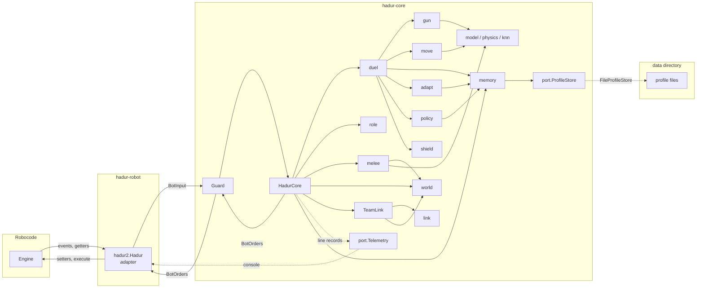
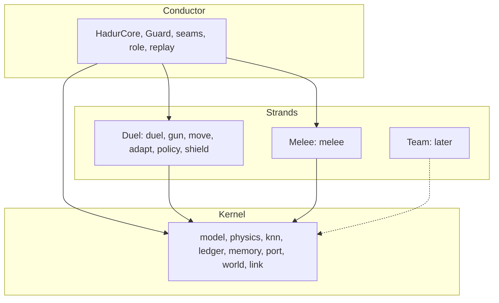
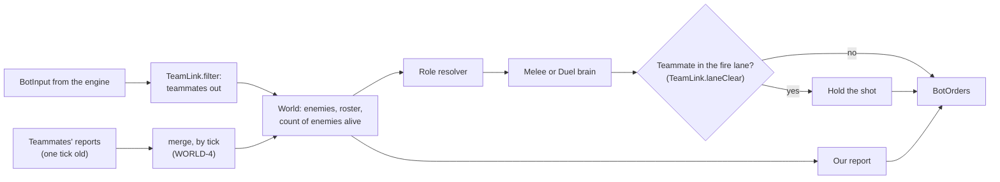

# Hadur 2 architecture

Hadur 2 is hexagonal: the strategy lives in a core that only sees plain values, and a
thin adapter connects it to Robocode. That split is what makes the rest of the plan
testable: the core can be replayed, fuzzed and fault-injected without an engine.

## Modules

| Module | Holds | Built for |
|---|---|---|
| `hadur-core` | the brain, as plain Java: every package listed below | Java 11 |
| `hadur-robot` | the adapter `hadur2.Hadur` (a `TeamRobot` from A4, so one class plays all three ladders; from A5 a second jar, `hadur2.HadurTeam`, fields five of it as a team), `hadur2.FileProfileStore`, and `hadur2.HadurRecorder` (the robot plus a transcript of its inputs and orders, for replay fixtures) | Java 11 |
| `hadur-bench` | headless battles in the real engine, the report, wave fidelity against the engine's truth | Java 17 |

`hadur-robot` shades the core into three jars. `hadur2.Hadur_<version>.jar` is the competition
jar, with the recorder left out; the `recorder` jar keeps it, and only the bench's
`--record` mode loads it. From A5 `hadur2.HadurTeam_<version>.jar` is the same classes as
the competition jar plus `hadur2/HadurTeam.team`, five `hadur2.Hadur` of that version. The Robocode API is `provided`: the engine supplies it at run
time, and the build compiles against the vendored 1.9.3.0 API in `repo/` (the bench runs
the 1.9.5.6 engine from Maven Central).

## The tick

Robocode runs a robot's event handlers inside `execute()`, then returns to `run()`. The
adapter mirrors that exactly:

1. Handlers (`onScannedRobot`, `onHitByBullet`, ...) turn each engine event into a
   `BotEvent` value and queue it, in the engine's own priority order.
2. The loop builds a `BotInput`: the robot's state from the getters plus the queued events.
3. `Guard.tick(input)` calls `HadurCore.tick(input)`, which handles the events first and
   then runs the main loop body, as 1.20 did.
4. The adapter applies the returned `BotOrders`. A `NaN` field means "leave the previous
   setting", the same as not calling that setter; a fire power of 0 means hold fire.
5. `execute()`.

The core and guard are static in the adapter, so learning survives from round to round
(Robocode creates a new robot object each round).

## Ports and values

| Type | Direction | What |
|---|---|---|
| `model.BotInput` | in | time, round, own position, heading, velocity, energy, gun and radar state, others, events |
| `model.BotEvent` | in | a closed set: `Scan`, `HitByBullet`, `BulletHit`, `BulletHitBullet`, `BulletMissed`, `HitWall`, `HitRobot`, `RobotDeath`, `SkippedTurn`, `TickTime` (S6: how long the core's last tick took, measured by the adapter) |
| `model.BotOrders` | out | body turn, ahead, max velocity, gun turn, radar turn, fire power |
| `port.Telemetry` | out | one line record at a time (`V`, `B`, `P`, `R`, `FAULT`, `EW`, `MEM`) |
| `port.ProfileStore` | both | named byte blobs with a quota: read, write (may be cut short), delete, list, size |

`ProfileStore` has two adapters: `port.MemoryProfileStore` for tests and the bench (it can
simulate a write killed part way), and `hadur2.FileProfileStore` in the robot, on Robocode's
data directory through `RobocodeFileOutputStream`.

## Packages in the core

| Package | Holds |
|---|---|
| `hadur2.core` | `HadurCore` (the conductor), `Guard` (RES-1), the seams `DuelSeam` and `MeleeSeam` (A2), `MeleeMemory` (the melee blocks in the profile store, MMEM-1), `Archive` (A4: each brain's shelf by charter, behind the store's gate, SHELF-1, SHELF-3; A5: only the scribe writes, SHELF-2), `TeamLink` (A5: the input a role sees on a team, the merge of teammates' reports, the fire lane and our own report) |
| `duel` | the Duel's brain (A2): `DuelController`, everything the duel does against one opponent, lifted out of `HadurCore`, and `Duress` (RES-9) |
| `model` | the port values, robot states and their logs, waves and the wave manager, the battle's facts, the round's counters (`RoundStats`, RES-5) and the baton one role hands the next |
| `ledger` | `EnergyLedger`: explains the enemy's energy changes between scans so only bullet spending becomes a wave (WAVE-1, WAVE-2) |
| `physics` | `Angles` and `Rules` (bit-identical to Robocode's), battle field, movement prediction |
| `knn` | KD-tree and KNN views |
| `gun` | main KNN gun, anti-surfer gun, gun selection |
| `move` | wave-surfing movement and its danger formulas; our bullets in flight and the shadows they cast (MOVE-1); go-to surfing; the rammer escape (`RamEscape`, RAM-2) and the planned path against a mirror mover (`MirrorDrive`, MIR-1) |
| `role` | the role contract and its resolution (ROLE, WEAVE, GATE-2..5): `Role`, `Tick`, the battle's `Charter`, the `RoleResolver` with its latch (A1, in place of the melee extension's `PostureGate`), `DuelFocus` (the one opponent the duel fights while several are alive) and `SentryFence` (the sentry border as a wall for the duel's movement) |
| `world` | the World (A3, WORLD-1): one picture of the field, `EnemyTracker` with each robot's `EnemyInfo` and the enemy shots it infers (`EnemyShot`), fed by the conductor before any role; the melee brain reads it. A5 adds the `Roster` of teammates and the count of enemies alive (WORLD-3, WORLD-8), and the shot lifetime from the field |
| `melee` | the melee brain (MELEE-2..8, MRADAR, MSENSE, MMOVE, MGUN): sweep radar, minimum-risk movement with virtual bullets, field gun with a play-it-forward history per opponent, energy table, targeting waves, posture strategy, battle-long opponent stats; the melee profile block, its round folder and its binary codec (MMEM-1) |
| `memory` | opponent memory (MEM-1..5, RES-3): lineage keys, the profile, its binary codec, the round folder and the library that loads, saves and evicts; estimates with margins of error, the tiers and the seed layout |
| `adapt` | recognise and adapt (ADAPT-1..3, DIAL-1..2, RES-4): the opening book, the seed loader and the seed trust |
| `policy` | aggressive (DIST-1, POW-1, POW-2, END-1, END-2): rolling hit-rate windows, the distance controller, the power policy, the endgame states and the enemy gun-heat estimate; unhittable (MOVE-2, TIME-1, TIME-2): the movement flavour and the tick budget; recognising a rammer (`RammerPolicy`, RAM-1, RAM-2) and a mirror mover (`MirrorDetector`, MIR-1) |
| `shield` | the bullet-shielding counter (SHIELD-1, SHIELD-2): the shield detector and the anti-shield aim jitter |
| `replay` | the line codec and replay driver for recorded battles (CORE-2) |
| `link` | teammates' reports as bytes (A4, LINK-1, LINK-2): `Report` and `LinkCodec`, versioned and checksummed |
| `port` | outbound interfaces, and `GatedProfileStore` (A4), a store with a gate on writes and deletes |

ArchUnit enforces the boundary on every build: no `robocode.*` in the core, only JDK
`java.lang`, `java.util` and `java.awt.geom`; no randomness, threads, reflection, I/O or
clock; no mutable static fields; model, physics and ports never depend on gun, movement
or replay; gun and movement never depend on each other; the ledger depends only on
physics, so nothing but the engine's rules decides which drops become waves; melee depends
only on the model, physics, the kd-tree and the World, which reads no strand; no duel package depends on melee; memory depends only on
itself and the ports, and no gun, movement, melee, ledger or model code depends on memory;
the adapt and policy packages see neither `BotInput` nor `BotEvent` (DIAL-2), and no gun,
movement or lower package depends on them; the `role` package depends only on the model and
physics, and no brain or kernel package sees it.

`DuelIdentityTest` adds the melee extension's rule that "1v1 is sacred": it pins a hash of
every source file in the duel's packages (adapt, gun, knn, ledger, memory, move, physics,
policy, shield), taken at M0, so melee work that edits one fails the build.

## Owners: one identity, three strands

The architecture evolution ([architecture-evolution.md](architecture-evolution.md), stages
A0 to A5) adds a second boundary inside the core, between what Hadur is and how it fights
in each kind of battle. From A0 every package has exactly one owner, written in
`hadur-core/src/test/resources/ownership.txt` and enforced by `StrandOwnershipTest`:

| Owner | Packages | Rule |
|---|---|---|
| Kernel | `model`, `physics`, `knn`, `ledger`, `memory`, `port`, `world` (A3), `link` (A4) | depends on no strand and not on the conductor (STRAND-2) |
| Duel strand | `gun`, `move`, `adapt`, `policy`, `shield`, `duel` (A2) | sees only the kernel and itself |
| Melee strand | `melee` | sees only the kernel and itself |
| Team strand | none yet (the A5 baseline lives in the conductor's `TeamLink`) | from the Team plan |
| Conductor | the root package, `role`, `replay` | runs the tick and owns the seams |

A package with no owner fails the build (STRAND-1). Each owner's sources are pinned by hash
in `pins/<owner>.sha256` (STRAND-3), and a stage re-pins only the owners it names. Every
replay fixture, duel and melee alike, must reproduce the live robot's orders, the telemetry
it was pinned with and the files the live robot left in its store (STRAND-4).

## Melee and duel

Melee is a second role of the same robot, and the duel is the default. Each tick,
before handling events, `HadurCore` asks the `role.RoleResolver` which role drives, and
never mixes them. Since A2 each role is a brain behind the `role.Role` contract, driven
through the conductor's seam for it: `duel.DuelController` through `DuelSeam`, and
`melee.MeleeController` through `MeleeSeam`. Every event is offered to the charter's roles,
Melee before Duel (ROLE-5); only the driving role writes orders (WEAVE-1), and only with the
conductor's fire permission (WEAVE-3).

- **Melee** (ROLE-3) while two or more opponents are alive, no sentry robot is alive or has
  been scanned this round, and the melee subsystems have not thrown this round. Every
  scan, hit and death goes first to the World (`world.EnemyTracker`, WORLD-1), whichever
  role drives, and then to `melee.MeleeController`, which returns the radar sweep, a
  destination and the aim; the duel's waves, ledger and guns are not fed.
- **The duel** otherwise, from the same tick (GATE-2). When melee hands over, the core
  forgets its duel tracking and lifts the melee speed limit (MELEE-2), and the duel starts
  from the survivor's next scan.

Robocode leaves sentries out of `getOthers()`. A scanned sentry vetoes melee for the rest
of the round (GATE-3), as does a melee exception, which is caught, recorded as a `FAULT`
line and counted (GATE-4). Sentries are never passed to the World, the duel or
opponent memory, and their bullets never reach the duel's ledger (GATE-5).

When the duel drives with several opponents alive (a vetoed melee), `role.DuelFocus`
names the one it fights: the closest when the duel takes over, kept until it dies. Scans
and hits of the others go only to the World and the melee brain, so the duel's model is about one robot.
With sentries on the field, `role.SentryFence` checks the duel's orders by simulating 12
ticks of the engine's movement, and replaces them with a drive to the centre if they would
come within 30 px of the border zone. The fence only replaces the drive: the gun, the
radar and the fire order pass through untouched (WEAVE-2).

A 1v1 battle never enters melee, and since A3 holds only the Duel's brain: no melee brain,
no World and no melee seam are built (ROLE-6), so none of this routing runs in one. Each round of a battle with several opponents or sentries ends
with an `M` record: ticks per posture, the veto, melee faults, the longest scan gap, ticks
aimed at a dead robot, our bullets that hit a sentry, the longest gap while four or more
were alive, and robots dropped as dead without a death event.

### Melee sensing

`world.EnemyTracker` (in `melee` until A3) is the World the melee brain reads: every opponent's last
position, heading, velocity, energy and scan tick. A death takes an opponent out of the
movement's risk and the gun's targets on the same tick (MSENSE-1). While more are tracked
than the engine counts alive, a death the core never heard of, the one scanned longest ago
goes once two full sweeps (16 ticks) have missed it and it cannot have left radar range.
The count does not say which robot died: a live one dropped by mistake comes back on its
next scan, and the dead one, which cannot be scanned again, goes next. An energy drop of
0.1 to 3 that the core cannot explain as our bullet's damage, or as a wall or robot
collision (a stop next to a wall or another robot), is recorded as an `EnemyShot`
(MSENSE-2). After consecutive scans it was fired the tick before, from where the opponent
was; across a gap it takes the middle of the ticks it could have fired in, from the matching
point between the two scans, and carries that half-width as `window`. A bigger drop is
another robot's hit, unless the gap fits several shots (one every 11 ticks at most) that
could add up to it; that drop is recorded as neither.

`melee.MeleeRadar` spins while four or more opponents are alive (MRADAR-1). With two or
three it turns toward the one scanned longest ago (MRADAR-2), rescans a weak target the gun
wants to finish every other tick unless someone else is a sweep overdue, and once it turns
toward an opponent keeps turning that way until it finds it. The 1.x radar reversed about
a moved opponent's old bearing and could lose the field for hundreds of ticks. A spin sees
each robot about every 8 ticks; a close robot moving the same way as the sweep can stretch
that to 10 or 11.

### Melee movement

`melee.MinimumRiskMovement` scores 160 candidate points each tick (32 angles on 5 rings of
100 to 300 px, capped at 0.8 of the distance to the nearest opponent whose scan is not stale,
never below 36 px) and heads for the
least risky, keeping its destination until a point 10% safer turns up (MMOVE-1). Risk is
each opponent's energy over distance squared, doubled where Hadur would be that opponent's
closest robot (a neighbour unseen for longer than a sweep counts as far as it could have moved) and half again for one that hit Hadur recently (MMOVE-2); a head-on and a
linear `VirtualBullet` for every recorded `EnemyShot`, scored at the candidate when Hadur
gets there but not along the route (virtual bullets are guesses, and counting every guessed
path Hadur would cross cost 3 to 5 APS; the destination is re-scored every tick), with a shot's fire-tick uncertainty widening its window
and delaying its expiry, and bullets that never come within reach of a candidate skipped (MMOVE-3); a pull off the centre, pushes off walls and corners, Hadur's
recent positions and a fixed noise field; and the melee strategy's posture, which keeps
Hadur clear of two opponents fighting each other and within reach of the weaker (MMOVE-5),
herds the weaker of the last two, and keeps to the edge of the field while Hadur leads. For the first
30 ticks the closest-robot term doubles again and a pull heads for a wall-adjacent spot
away from the corners. With two opponents left the ring shrinks to 80 to 200 px and the
lateral weight rises, so Hadur is already orbiting when the duel takes over (MMOVE-4).

### Melee gun

`melee.FieldGun` has no single target (MGUN-1). Every opponent scanned in the last 8 ticks
gets three firing solutions: `melee.EnemyHistory` keeps a battle-long kd-tree per opponent
(distance, speed, turn rate, time since reversing, wall distance; the melee package may use
`knn.KdTree` and nothing else of the duel's) of situations paired with the 90 ticks of
movement that followed, and the three most like the present are played forward until
Hadur's bullet would arrive. Each solution covers its angle plus or minus the robot's
half-width, weighted by 1/distance and by the opponent's weakness, doubled for a finisher,
1.3 for an isolated opponent and 1.5 for one that has hit Hadur twice in 200 ticks; the gun
fires where the summed density peaks. An opponent with too little history gets a circular
or linear solution, and a robot ramming Hadur inside 100 px is left to the movement unless
it can be finished. `melee.MeleeEnergyPolicy` sets the power (MGUN-2, MGUN-3): the exact
kill below 16 energy, the duel's table with two or fewer left, else 1.0 to 3.0 by distance,
and nothing below 1 energy of its own. The strategy's posture never lowers that power or
holds fire (MGUN-5): until M6 it halved the power and held fire beyond 400 px while two others
fought, and cut it by 30% and held beyond 600 px while Hadur led. Removing that raised
Hadur's bullet damage by about 15% at the same APS in the M6 sweep
([docs/bench/m6-gates.md](bench/m6-gates.md)). `melee.MeleeWaves` sends a wave at every opponent on
every gun-heat cycle carrying the gun's aim (MGUN-4), and the M record counts the waves and
the virtual hits, so the bench reads the gun's hit rate on the whole field.

### Melee memory and hand-off

A melee battle keeps a melee profile block per opponent, `melee.MeleeProfile`, apart from its
1v1 profile (MMEM-1): the opponent's inferred shots and how many hit Hadur, whether those
hits were aimed head-on or led, the mean power of its shots, the share of its close scans
(inside 200 px) at ramming range (inside 60 px), and its mean finishing place among the
opponents. The melee brain feeds a `melee.MeleeProfileFolder` from the events it already
handles; when the round ends the core folds each scanned opponent's round into its block,
and each group of counts is halved once it passes its limit, as the 1v1 profile's are.
`MeleeProfileCodec` writes a block in the 1v1 profile's style (magic `HM`, version 1,
length, payload, CRC-32) and reads only version 1; damage of any kind throws one exception
type.

`hadur2.core.MeleeMemory` keeps the blocks in the same `ProfileStore`, one file per opponent
named like its 1v1 profile with `.hm` for `.hp`, so the 1v1 library, which only touches
`.hp` files, never evicts one and a block never costs a 1v1 profile anything. A block is
loaded on the opponent's first scan (never a sentry's), and written with the 1v1 profile's
temporary-copy order (RES-3) at every checkpoint and at the battle's end. The adapter only
checkpoints while Hadur is alive, so a round Hadur dies in is folded at once and written at
the next checkpoint. All blocks together stay under 16 KB, the least recently fought going
first; a write that would take the store past 90% of its quota is skipped. Failures are
counted, reported in `MEM` records and in the M record's last field, and never thrown.

When a melee's opponents fall to one, the survivor's first scan hands it to the duel
(MMEM-2), before the duel adds its own wave for that scan. The shots the melee tracker saw
the survivor fire that have not reached Hadur become firing waves in the duel's movement,
their features taken from where Hadur was when each was fired, so the surf dodges bullets
already in the air. The survivor's 1v1 profile is read, once a battle, by a library that
never saves: melee rounds do not change a 1v1 profile. Its opening sets the surf's prior and
flattener, the starting distance, the movement flavour's baseline and POW-1's gun tier, and
the surf's prior still fades when the live rate disagrees (RES-4). Seeds are not replayed
(the duel's views are shared by every survivor of the battle) and the gun's opening is left
alone (the virtual guns only run in a 1v1 battle). A bullet from a robot that died this round
is no longer credited to the survivor's energy in the ledger. An `H` record
(`H,round,tick,survivor,found1v1,foundMelee,wavesInjected`) says what was handed over. A
melee vetoed by a sentry or a fault hands nothing over.

## The team baseline

From A5 Hadur can fight as one of five. `hadur2.HadurTeam` is five `hadur2.Hadur` of the
same version, and nothing in the strands knows it is on a team. The conductor's `TeamLink`
does the work around them, so the Team strand is still empty: its tactics come from the
Team plan.

- **The roster.** `BattleFacts` names our teammates at tick 0, and the World's `Roster`
  keeps their last known positions. A teammate silent for 20 ticks while the engine's
  count of others has fallen is counted dead (WORLD-3).
- **The filtered input.** Each tick `TeamLink` takes teammates' scans, hits and deaths out
  of the input the roles see (WORLD-2, WORLD-6, WORLD-7), so no brain targets or counts a
  teammate. A role sees only enemies, and Melee drives while two or more of them live.
- **Shared eyes.** Every member sends one `link.Report` a tick while a teammate lives
  (LINK-4): its own state, its fresh sightings, the deaths it knows of and its bullet
  events, versioned and checksummed (LINK-1, LINK-2). Reports merge into the World once,
  in the order of their ticks, keeping the newer sighting (WORLD-4). A reported death
  closes that robot's books only once.
- **A count that errs upward.** On a team the count of enemies alive is the smaller of
  two upper bounds: the engine's others less the teammates heard from, and the starting
  enemies less those known dead (WORLD-8). It is never below the truth, so Melee never
  hands over to the Duel too early. With no report at all the role still resolves from
  the engine's facts (LINK-3).
- **The fire lane.** A shot is held while a living teammate lies in the lane ahead of the
  gun's present heading: within 24 px of it, plus 8 px for each tick since that teammate's
  last known position (WEAVE-4). A position older than the WORLD-3 window (20 ticks) is not
  checked. On a team the Guard holds fire rather than firing blind (WEAVE-5).
- **One scribe.** Only the team leader writes to the store, and in a team battle it
  writes only its health record (SHELF-2), so five members never race for the same files.

The bench's team mode (`--team true`) runs the team jar against `team-reference.txt` with
one transcript per member. The baseline on record is 28.1% of the score over eight real
teams, with no faults and no undercount ([bench/a5-team.md](bench/a5-team.md)).

## Opponent memory

In a duel, the first scan hands the opponent's name to `memory.ProfileLibrary`, which files
it under a lineage key (`abc.Shadow 3.84 (2)` is `abc.Shadow`) and loads that profile before
the tick's orders are made (MEM-1). While the round runs, the core reports shots, hits and
scans to a `ProfileFolder`; at the round's end they are folded into the profile (MEM-2).
The adapter saves it at the end of every round Hadur survives, as a checkpoint, and at the
battle's end (MEM-3). The file work that needs no name (the battle clock, the codec's first
use) happens in `run()` before the first tick, so the first scan's load costs about 0.3 ms.

The file format is hand-written: magic, version byte, length, payload, CRC-32. Decoding
either gives a sane profile or throws one exception type, which the library turns into "a
stranger" plus a counted failure (MEM-4). Robocode forbids renaming files, so a save writes
`<file>.tmp`, then the profile, then deletes the copy; a load takes whichever passes its
checksum, so a robot killed at any byte keeps a loadable profile (RES-3). Before writing,
if the store would pass 90% of its quota, the seeds of the least recently fought profiles
are dropped first (MEM-5); a battle counter file (`battles.hc`) is what "recent" means.

A melee battle never saves a 1v1 profile; it reads the survivor's for the duel's opening and
keeps melee blocks of its own (see "Melee memory and hand-off").

Robocode charges the data quota for every byte written: opening a file for writing refunds
its old length, but deleting it refunds nothing. `FileProfileStore.delete` therefore empties
a file through the stream before deleting it, or each save would leak the temporary copy's
size until the battle ends (with seeded profiles, the quota ran out by round ten).

## Recognise and adapt

At the first scan, right after the profile loads, `adapt.OpeningBook` reads it once and
returns an `Opening`: the gun tier (their normalised hit rate on us) and the movement tier
(our virtual guns' ratings), each named only while its margin of error is at most 3 points
(DIAL-1), and what follows from them:

| Decision | From | Applied through |
|---|---|---|
| First gun: anti-surfer for M2/M3, main for M0/M1, 1.20's rule when unknown (ADAPT-1) | movement tier | `GunController.setOpening`; the live virtual-gun ratings take over once they differ by more than their margin |
| Flattener views on from the first surfable wave for T3 (ADAPT-2) | gun tier | `MoveController.setFlattenerFirst` |
| The surf's view thresholds read the profile's hit rate while it is more certain than the live one | any known gun tier | `MoveController.setPrior` |
| Gun and surf seeds replayed at weight 0.5 (ADAPT-3) | the profile's seeds | `GunController.seed`, `MoveController.seed`, 50 samples a tick |

A seeded sample carries a shared `model.SeedWeight`; the main gun's density, the anti-surfer
gun's and the surf's danger multiply each neighbour by it (a live sample weighs 1, which
leaves 1.20's arithmetic bit for bit). Two `adapt.SeedTrust`s watch the seeds, one wave at a
time: the gun seed against our main gun's live virtual rating, the surf seed against their
live normalised hit rate. Once the live estimate is within 5 points and disagrees with the
profile's by more than either margin, the seed loses a twentieth of its weight each wave,
reaching zero within 20 waves (RES-4), and the opening it came with (the gun choice, the
surf prior and the flattener) goes back to live data.

While the round runs, each real bullet's gun wave and each enemy hit on us become seed
samples in the `ProfileFolder`, which keeps the latest 600 and 300 and folds them into the
profile at the round's end (MEM-2); `memory.Seeds` quantises them to shorts. P records
(`P,round,tick,policy,value,margin,setting`) say what the book chose and each seed decay.

## Aggressive

S5 replaces 1.20's fixed 650 px with `policy.DistancePolicy`, and adds a power policy and
the endgame. `HadurCore` owns them and applies their decisions each duel tick; gun and
movement only see the results through setters.

| Decision | From | Applied through |
|---|---|---|
| Starting distance: 650 for a stranger, 400 / 450 / 500 / 550 for T0 to T3 | gun tier (`Opening.distance`) | `DistancePolicy` |
| Target in 25 px on each enemy wave while our rolling hit rate leads theirs by 5 points or more beyond its margin of error (DIST-1, DIAL-1); out 25 px while theirs leads by as much; within [400, 650] | two `HitWindow`s of the last 100 shots each | `SurfMover.setDesiredDistance`, which the surf's and the orbit's attack angles steer to |
| Full power: T0 profile and enemy energy above 12 (POW-1), or a certain 20%+ against a certain sub-10% (POW-2); capped at a quarter of their energy, never while ours is 12 or less | gun tier, both windows | the gun wave's bullet power in `onScan` |
| Finish: target 150 while enemy energy is under 16, ours over 40 and their gun hotter than ours (END-1) | energies, `EnemyGunHeat`, our gun heat | `DistancePolicy.target(true)` |
| Ram: drive straight at a disabled enemy (END-2) | enemy energy 0 | `SurfMover.ram` in place of the surf |

P records mark the opening distance (`distance`, `<tier>:<px>`), each step
(`distance`, the gap, its margin, the new target), each change of power reason (`power`)
and of endgame state (`endgame`). R fields 23-27 carry the round's mean scan distance, the
target at the round's end, finishing and ramming ticks, and full-power shots; the bench's
Aggression section reads them.

## Unhittable

S6 makes Hadur harder to hit and keeps it inside its turn.

| Decision | From | Applied through |
|---|---|---|
| Bullet shadows: angles of an enemy wave where one of our bullets in flight meets its bullet (MOVE-1) | `move.OurBullet`s (fired from where we stood, along the gun's heading), the wave | `Wave.shadowedFraction`, which scales the surf's danger at each intersection |
| Movement flavour: flattener, then go-to surfing, then the band 100 px out, each added when their hit rate beats the profile's by more than the margin (MOVE-2, DIAL-1) | the profile's hit rate, a window of their waves since the last change | `MoveController.setFlattenerFirst`, `SurfMover.setMode` (from the next surfed wave), `DistancePolicy.shiftOut` |
| Computation level 0-3: one wave and no go-to, then half k, then no virtual-gun scoring (TIME-1, TIME-2) | `TickTime` events, skipped turns | `SurfMover.move`'s wave count and mode, `KnnView.setKShare`, the virtual-gun call |

**Shadows follow the engine's order of play.** Each turn the engine moves every bullet
before any robot, one bullet at a time in a random order, and each bullet checks its new
segment against the others' segments as they stand. So an enemy bullet and ours always
meet if their segments of the same turn cross (the certain shadow), and meet in about half
the turns if one's move crosses the other's previous segment (the possible shadow). A
robot, moved after the bullets, meets the next turn's segment, which is why a wave's robot
intersection reads one turn ahead of its shadows. `BulletShadowsProperties` checks the
geometry against a brute-force flight of both bullets; the bench checks it against the
engine: every enemy bullet one of ours destroyed fell inside a possible shadow.

**The tick time is an event, not a clock.** The adapter measures how long `Guard.tick`
took and hands it to the next tick as `TickTime`, with its assumed allowance (3 ms; a
robot cannot read the engine's CPU constant). The replay fixtures record it like any other
event, so a replay makes the same decisions (CORE-2), and ArchUnit's ban on clocks in the
core stands.

P records mark each flavour change (`move-flavour`, with the live hit rate and margin that
made it and the step added) and each change of computation level (`budget`, with the new level). R fields 28-32 carry slow ticks, shadowed waves, flavour changes, the flavour
step reached and the intercepts that fell inside a shadow; field 13, the computation level,
is now the highest the round used. The bench's Unhittable section reads them.

## Java version

The shipped classes (core and adapter) are compiled for Java 11 (REL-1), because RoboRumble
clients run whatever Java their owners installed. Records, sealed types and pattern
matching are therefore not used in main code; tests and the bench use Java 17.

## Faults

`Guard` wraps every core call. If the core throws, or returns nothing, the guard counts the
fault, writes one `FAULT` record for the round, and returns safe orders for that tick:
full speed, hold fire, body side-on to the enemy's last bearing in the current direction of
travel, radar locked on that bearing (or sweeping if the enemy was never seen). On the next
scan it asks the core to drop its transient round state (waves, logs) and carry on with
everything it has learned.

## Determinism

Given the same inputs, the core issues the same orders (CORE-2). The ArchUnit rules keep out
the usual sources of drift, the 1.20 code's `Math.random` view names and a global view
counter were removed, and the replay tests check the property end to end against battles
recorded from the real robot in the real engine.

Since A0 the check covers the whole robot, not only the orders. The recorder also logs the
store the battle started on, the adapter's round-end, checkpoint, battle-end and
health-record calls, and the files the battle left; the tests' `FixtureReplay` makes the
same calls with its own guard, and `ReplayTest` compares orders with the live robot's,
telemetry with a pinned snapshot (`replay/telemetry/`) and the store with the live robot's
files. Eleven fixtures cover the six S1 duels, a ten-robot melee, a melee with a border
sentry, a melee that hands a known survivor to the duel, a warm duel on a seeded store and a
duel in RES-9's duress (STRAND-4).

## Bounded growth

Everything that grows during a battle is capped (RES-2): robot state logs keep the latest
5,000 states, KNN views without their own limit keep 50,000 points, and the wave manager
drops a wave's state log when the wave breaks. Other collections are cleared each round or
keyed by opponent name.
