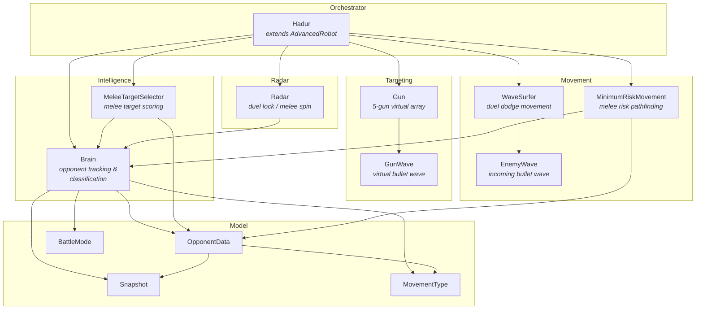
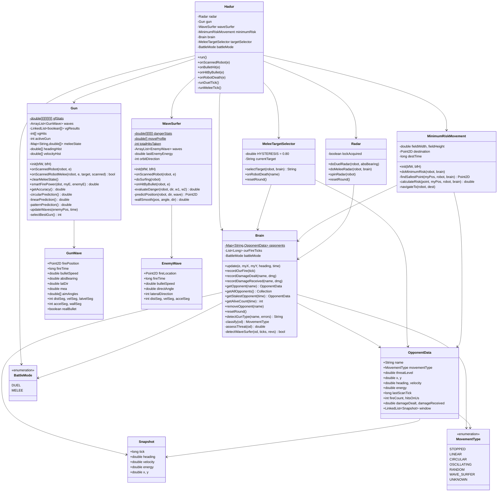
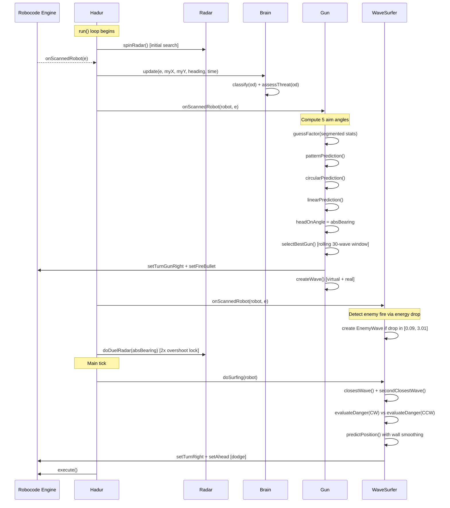
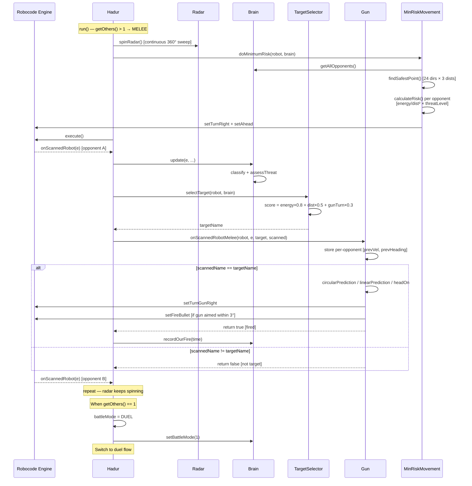

# Hadur v1.17 Architecture

Hadur is a dual-mode competitive Robocode robot that automatically switches between
specialised 1v1 (duel) and free-for-all (melee) strategies based on the number of
opponents. This document describes the subsystem architecture, class relationships,
and runtime control flow.

## Subsystem Overview

The robot is organised into five subsystems, each responsible for a single concern.
The main `Hadur` class orchestrates them, routing events and selecting the correct
mode-specific behaviour each tick.



## Class Diagram

Key fields and methods for each class. Static fields that persist across rounds are
marked with `$`.



## Duel Mode Flow

In 1v1 battles, Hadur uses a tight radar lock, wave surfing for dodging, and a
five-gun virtual gun array for targeting. The radar locks onto the single opponent
with a 2x-overshoot technique. The gun fires virtual waves from all five prediction
methods and selects the one with the best rolling hit rate.



## Melee Mode Flow

In free-for-all battles (3+ robots), Hadur switches to a spinning radar for full
coverage, minimum-risk movement to avoid crossfire, and a simplified multi-prediction
gun aimed at the highest-priority target. The target selector scores opponents by
a weighted sum of energy, distance, and gun-turn angle.



## Data Flow — Intelligence Pipeline

The Brain maintains a sliding window of 100 snapshots per opponent and uses
statistical analysis to classify movement patterns and assess threat levels.
This intelligence feeds into both movement (risk weighting) and target selection.

```mermaid
flowchart LR
    subgraph Input
        SE[ScannedRobotEvent]
    end

    subgraph Brain
        UP[update]
        FD[Fire Detection<br><i>energy drop 0.09–3.01</i>]
        SW[Sliding Window<br><i>100 snapshots</i>]
        CL[classify]
        AT[assessThreat]
    end

    subgraph Classification
        WV[WAVE_SURFER<br><i>reversals correlate<br>with our fire ticks</i>]
        LI[LINEAR<br><i>avgHC &lt; 0.03<br>revRate &lt; 0.04</i>]
        OS[OSCILLATING<br><i>revRate &ge; 0.06</i>]
        CI[CIRCULAR<br><i>avgHC &ge; 0.03<br>low variance</i>]
        RA[RANDOM<br><i>cv &ge; 0.8 or<br>stdHC &gt; 0.04</i>]
        ST[STOPPED<br><i>&gt;80% stationary</i>]
    end

    subgraph Threat ["Threat Score (0–1)"]
        ACC[Accuracy 35%]
        ENE[Energy 25%]
        AGG[Aggression 20%]
        POW[Bullet Power 20%]
    end

    subgraph Consumers
        MR[MinimumRiskMovement<br><i>risk × (0.5 + threat)</i>]
        MTS[MeleeTargetSelector<br><i>energy × 0.8 + dist × 0.5</i>]
        GUN[Gun<br><i>fire power selection</i>]
    end

    SE --> UP
    UP --> FD
    UP --> SW
    SW --> CL
    SW --> AT
    CL --> WV
    CL --> LI
    CL --> OS
    CL --> CI
    CL --> RA
    CL --> ST
    AT --> ACC
    AT --> ENE
    AT --> AGG
    AT --> POW

    CL --> |movementType| MTS
    AT --> |threatLevel| MR
    AT --> |threatLevel| MTS
    FD --> |fireCount| GUN
```

## Static Persistence Across Rounds

Several data structures use `static` fields to accumulate learning across rounds
within the same battle. This allows the robot to improve targeting and movement
as it observes more of each opponent's behaviour.

| Class | Field | Shape | Purpose |
|-------|-------|-------|---------|
| `Brain` | `opponents` | `Map<String, OpponentData>` | Per-opponent tracking, classification, threat |
| `Gun` | `gfStats` | `double[5][5][5][3][3][31]` | GuessFactor hit bins segmented by distance, velocity, lateral velocity, acceleration, wall proximity |
| `WaveSurfer` | `dangerStats` | `double[5][5][3][47]` | Danger bins segmented by distance, velocity, acceleration |
| `WaveSurfer` | `moveProfile` | `double[47]` | Visit-count profile for movement flattening |
| `Hadur` | `roundsPlayed/Won` | `int` | Win rate tracking |
