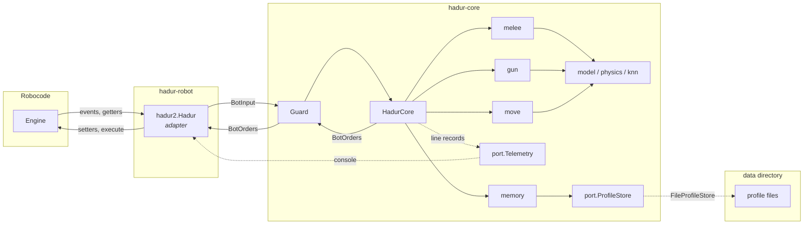

# Hadur 2 architecture

Hadur 2 is hexagonal: the strategy lives in a core that only sees plain values, and a
thin adapter connects it to Robocode. That split is what makes the rest of the plan
testable: the core can be replayed, fuzzed and fault-injected without an engine.

## The tick

Robocode runs a robot's event handlers inside `execute()`, then returns to `run()`. The
adapter mirrors that exactly:

1. Handlers (`onScannedRobot`, `onHitByBullet`, ...) turn each engine event into a
   `BotEvent` value and queue it, in the engine's own priority order.
2. The loop builds a `BotInput`: the robot's state from the getters plus the queued events.
3. `Guard.tick(input)` calls `HadurCore.tick(input)`, which handles the events first and
   then runs the main loop body, as 1.20 did.
4. The adapter applies the returned `BotOrders`. A `NaN` field means "leave the previous
   setting", the same as not calling that setter; a fire power of 0 means hold fire.
5. `execute()`.

The core and guard are static in the adapter, so learning survives from round to round
(Robocode creates a new robot object each round).

## Ports and values

| Type | Direction | What |
|---|---|---|
| `model.BotInput` | in | time, round, own position, heading, velocity, energy, gun and radar state, others, events |
| `model.BotEvent` | in | a closed set: `Scan`, `HitByBullet`, `BulletHit`, `BulletHitBullet`, `BulletMissed`, `HitWall`, `HitRobot`, `RobotDeath`, `SkippedTurn` |
| `model.BotOrders` | out | body turn, ahead, max velocity, gun turn, radar turn, fire power |
| `port.Telemetry` | out | one line record at a time (`V`, `B`, `R`, `FAULT`, `EW`, `MEM`) |
| `port.ProfileStore` | both | named byte blobs with a quota: read, write (may be cut short), delete, list, size |

`ProfileStore` has two adapters: `port.MemoryProfileStore` for tests and the bench (it can
simulate a write killed part way), and `hadur2.FileProfileStore` in the robot, on Robocode's
data directory through `RobocodeFileOutputStream`. S6 adds a `Clock` port.

## Packages in the core

| Package | Holds |
|---|---|
| `hadur2.core` | `HadurCore` (the brain), `Guard` (RES-1), `RoundStats` (RES-5) |
| `model` | the port values, robot states and their logs, waves and the wave manager |
| `ledger` | `EnergyLedger`: explains the enemy's energy changes between scans so only bullet spending becomes a wave (WAVE-1, WAVE-2) |
| `physics` | `Angles` and `Rules` (bit-identical to Robocode's), battle field, movement prediction |
| `knn` | KD-tree and KNN views |
| `gun` | main KNN gun, anti-surfer gun, gun selection |
| `move` | wave-surfing movement and its danger formulas |
| `melee` | the melee brain (MELEE-1..8): opponent tracker, sweep radar, minimum-risk mover, target selector, circular gun, posture strategy, battle-long opponent stats |
| `memory` | opponent memory (MEM-1..5, RES-3): lineage keys, the profile, its binary codec, the round folder and the library that loads, saves and evicts |
| `replay` | the line codec and replay driver for recorded battles (CORE-2) |
| `port` | outbound interfaces |

ArchUnit enforces the boundary on every build: no `robocode.*` in the core, only JDK
`java.lang`, `java.util` and `java.awt.geom`; no randomness, threads, reflection, I/O or
clock; no mutable static fields; model, physics and ports never depend on gun, movement
or replay; gun and movement never depend on each other; the ledger depends only on
physics, so nothing but the engine's rules decides which drops become waves; melee depends
only on the model and physics, and no duel package depends on melee; memory depends only on
itself and the ports, and no gun, movement, melee, ledger or model code depends on memory.

## Melee and duel

`HadurCore` picks the brain each tick from the number of opponents alive (MELEE-1). With two
or more, every scan, hit and death goes to `melee.MeleeController`, which returns the radar
sweep, a destination and the aim; the duel's waves, ledger and guns are not fed. When the
count drops to one, the core forgets its duel tracking and lifts the melee speed limit
(MELEE-2), and the duel machinery starts from the survivor's next scan. A 1v1 battle never
enters melee, so the duel's replay fixtures are unchanged.

## Opponent memory

In a duel, the first scan hands the opponent's name to `memory.ProfileLibrary`, which files
it under a lineage key (`abc.Shadow 3.84 (2)` is `abc.Shadow`) and loads that profile before
the tick's orders are made (MEM-1). While the round runs, the core reports shots, hits and
scans to a `ProfileFolder`; at the round's end they are folded into the profile (MEM-2).
The adapter saves it at the end of every round Hadur survives, as a checkpoint, and at the
battle's end (MEM-3). The file work that needs no name (the battle clock, the codec's first
use) happens in `run()` before the first tick, so the first scan's load costs about 0.3 ms.

The file format is hand-written: magic, version byte, length, payload, CRC-32. Decoding
either gives a sane profile or throws one exception type, which the library turns into "a
stranger" plus a counted failure (MEM-4). Robocode forbids renaming files, so a save writes
`<file>.tmp`, then the profile, then deletes the copy; a load takes whichever passes its
checksum, so a robot killed at any byte keeps a loadable profile (RES-3). Before writing,
if the store would pass 90% of its quota, the seeds of the least recently fought profiles
are dropped first (MEM-5); a battle counter file (`battles.hc`) is what "recent" means.

A melee battle neither loads nor saves profiles. In S3 nothing in a profile changes an
order; S4 reads its tiers and seeds.

## Java version

The shipped classes (core and adapter) are compiled for Java 11 (REL-1), because RoboRumble
clients run whatever Java their owners installed. Records, sealed types and pattern
matching are therefore not used in main code; tests and the bench use Java 17.

## Faults

`Guard` wraps every core call. If the core throws, or returns nothing, the guard counts the
fault, writes one `FAULT` record for the round, and returns safe orders for that tick:
full speed, hold fire, body side-on to the enemy's last bearing in the current direction of
travel, radar locked on that bearing (or sweeping if the enemy was never seen). On the next
scan it asks the core to drop its transient round state (waves, logs) and carry on with
everything it has learned.

## Determinism

Given the same inputs, the core issues the same orders (CORE-2). The ArchUnit rules keep out
the usual sources of drift, the 1.20 code's `Math.random` view names and a global view
counter were removed, and the replay tests check the property end to end against battles
recorded from the real robot in the real engine.

## Bounded growth

Everything that grows during a battle is capped (RES-2): robot state logs keep the latest
5,000 states, KNN views without their own limit keep 50,000 points, and the wave manager
drops a wave's state log when the wave breaks. Other collections are cleared each round or
keyed by opponent name.
